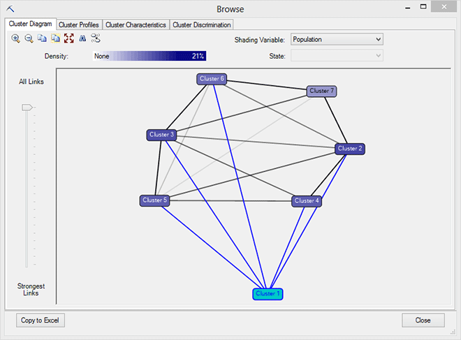
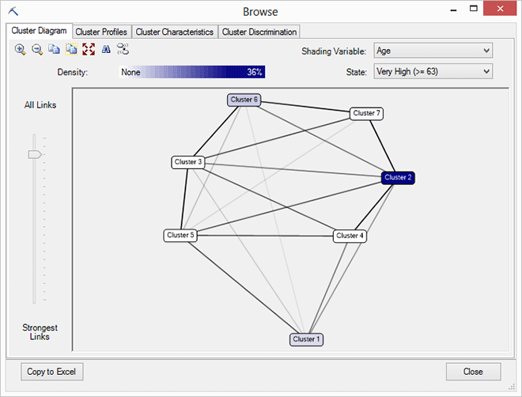
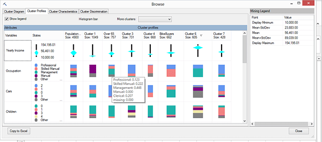
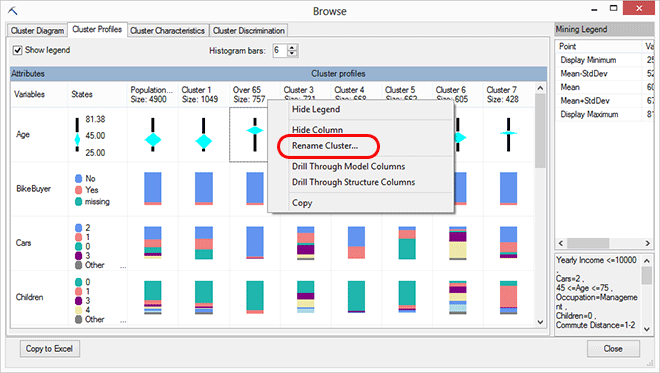
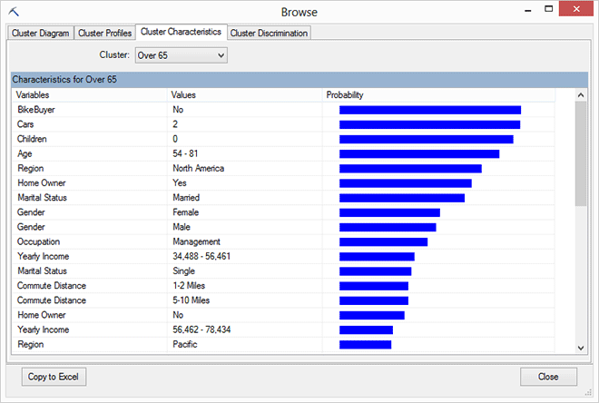
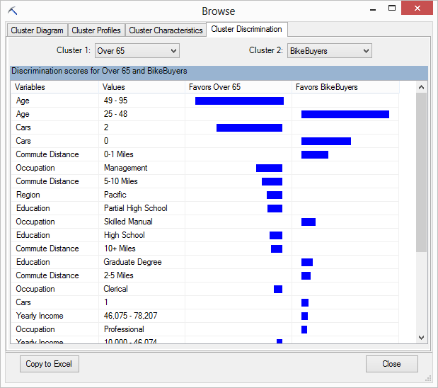
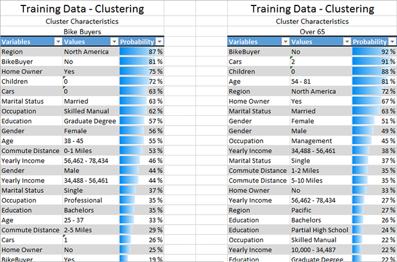

# Browsing a Clustering Model
  When you open a clustering model using **Browse**, the model is displayed in an interactive viewer, similar to the clustering viewer in [!INCLUDE[ssASnoversion](../includes/ssasnoversion-md.md)]. The viewer helps you explore the clusters that were created, and understand cluster characteristics. You can also compare and contrast individual segments with other segments or with the population.  
  
##   Explore the Model  
 The **Browse** window includes the following tools to help you understand your clustering model and explore the attributes of the underlying data groups:  
  
-   [Cluster Diagram](#BKMK_ClusterDiagram)  
  
-   [Cluster Profiles](#BKMK_ClusterProfiles)  
  
-   [Cluster Characteristics](#BKMK_ClusterCharacteristics)  
  
-   [Cluster Discrimination](#BKMK_ClusterDiscrimination)  
  
 To experiment with a clustering model, you can use the sample data on the Training tab of the sample data workbook, and build a clustering model using [Cluster Wizard &#40;Data Mining Add-ins for Excel&#41;](cluster-wizard-data-mining-add-ins-for-excel.md) and all the defaults.  
  
###   Cluster Diagram  
 The **Cluster Diagram** tab displays all the clusters that are in a mining model. Here you can see how many different groupings were found in your data set, and how near or far they are from each other.  
  
##### Explore the cluster diagram  
  
1.  Click Cluster 1 in the diagram.  
  
     Note how the gray lines connecting all clusters change so that lines leading to the selected cluster are highlighted in bright blue.  
  
       
  
     The intensity of the line that connects one cluster to another represents the strength of the similarity of the clusters. If the shading is light or nonexistent, the clusters are not very similar. As the line becomes darker, it indicates that the similarity between the two clusters is stronger.  
  
2.  Click and drag the slider to the left of the cluster diagram, to adjust how many lines the viewer shows.  
  
     When you drag the slider down, only the strongest links between clusters are shown. This helps you focus on related groups.  
  
3.  Notice the **Shading Variable** control in the upper right corner of the **Cluster Diagram** window.  
  
     By default, it is set to **Population**. What this means is that the darker clusters have greater support.  
  
4.  Pause over any cluster with the cursor.  
  
     A ToolTip is displayed that contains the population of that cluster.  
  
5.  Now, click the **Shading Variable** dropdown list and choose the **Age** variable. As you do so, a list of values appears in the **State** text box.  
  
     The Age column used as input to this model contains continuous numeric values, but for the purpose of clustering, the algorithm always discretizes numbers. Here you can see the bins, or groups that the algorithm created, such as “Very Low (\<=27)” and “Very High (>=63)”.  
  
6.  From the **State** dropdown lists, select **Very High** and see how the diagram changes.  
  
     By changing the shading variable, you can see at a glance which clusters contain more of this targeted age group, and which clusters contain very few customers in this age group.  
  
       
  
     The darker the shading, the larger the proportion of the target attribute and value distribution that cluster.  
  
7.  Locate the cluster that is shaded darkest when the **Shading Variable** is set to Age >65.  
  
     Hover the mouse over the cluster.  
  
     The value displayed in the ToolTip now shows you the population of customers in this cluster who are over 65.  
  
8.  Right-click the cluster and select **Rename Cluster**. Type a new name that is descriptive, such as **Over 65**. The new name is saved with the model to the server and can be used for identifying the cluster in the other clustering views.  
  
 [Back To Top](#BKMK_Tabs)  
  
###   Cluster Profiles  
 The **Cluster Profiles** tab lets you compare the makeup of all clusters at a glance. This is a good place to start when you are getting familiar with the model. This view is also useful later on, if you have been exploring a particular cluster and decide you need to find related ones.  
  
 **Cluster Profiles** also gives you a good overview of how the clusters are different from each other. Therefore, you might find it convenient to use this view to give each cluster a descriptive name.  
  
##### Explore the cluster profiles  
  
1.  Click the cell for Occupations, in the **States** column, to see the list of all values for Occupation.  
  
2.  Now move the cursor over Occupation in the cluster profiles.  
  
     The ToolTip shows the distribution of occupations in that cluster.  
  
       
  
     Notice that, in some clusters (such as the one in the graphic), the list of occupations is not complete, and some occupations are replaced with the label, **Other**.  
  
     This is by design, because it can be hard to tell the difference between many small bars in a histogram. By default only the bars of highest importance are retained, and the remaining bars are grouped together into a gray **Other** bucket.  
  
     To change the number of bars that are visible in any histogram, use the option **Histogram bars**.  
  
3.  Note that the **Age** column looks different from the others. Click the diamond in the chart used to represent Age.  
  
     The column Age originally contained only continuous numbers. The clustering algorithm requires discrete values, so it grouped the numeric values in the Age column into a limited number of age groups, based on the distribution of values.  
  
4.  Click one of the diamond charts in a cluster profile.  
  
     These diamond charts are displayed only when the source data uses continuous numeric values. The diamond charts provide some useful descriptive statistics, including the mean and standard deviation for that value in each cluster:  
  
    -   The line in the diamond chart represents the range of values for the attribute. The values are also shown in the **States** column at the left of the **Profiles** chart.  
  
    -   The center of the diamond is positioned at the mean for the node.  
  
    -   The width of the diamond represents the variance of the attribute at that node. Therefore, a thinner diamond indicates that the node can create a more accurate prediction.  
  
5.  To make more room in the graph, right-click a cluster you don’t need to view right away, and select **Hide Column**. This doesn’t delete it from the model, just collapses the column temporarily.  
  
     To view clusters that you’ve hidden, you can click and drag the column edge, or select the cluster name from the list, **More clusters**.  
  
6.  Scroll down the attribute list till you find Bike Buyer, and then find the cluster that has the highest percentage of Yes values.  
  
     Right-click the column heading for the cluster that you want to rename, select **Rename cluster**, and type **Bike Buyers**.  
  
     The new cluster name is persisted in all views, and on the server, until you reprocess the model.  
  
       
  
 **Tips**  
  
-   Click a column heading to sort the attributes in order of importance for that cluster.  
  
-   Drag columns to reorder them in the viewer.  
  
-   Click any cell in the profiles chart to view detailed statistics in the **Mining Legend**.  
  
-   Right-click any cell and select **Drillthrough model columns** to output the underlying data to a new worksheet in Excel.  
  
-   Right-click the cluster’s column heading and select **Drillthrough to structure data** to get detailed information about the cluster members that wasn’t included in the model.  
  
     For example, if you are profiling customers, you might leave the contact information in the underlying data (the mining structure) but not include it in the model, because it’s not useful for analysis. However, after customers have been assigned to clusters, you can view the detailed data by using drillthrough.  
  
 [Back To Top](#BKMK_Tabs)  
  
###   Cluster Characteristics  
 The Cluster Characteristics view lets you really explore a single cluster, to find which attributes most strongly characterize this group of data.  
  
##### Explore the cluster characteristics  
  
1.  Select the **Over 65** cluster from the **Cluster** list.  
  
     After you select a cluster, you can see in detail the characteristics that make up that specific cluster.  
  
     The attributes that the cluster contains are listed in the **Variables** columns, and the state of the listed attribute is listed in the **Values** column.  
  
     Attribute states are listed in order of importance, accompanied by their probability in this cluster, represented as a colored bar in the **Probability** column.  
  
       
  
2.  Click the **Variables** column to sort by attribute.  
  
     By changing the sort variable, you can more easily see how values for variables such as income or car ownership are distributed in the group.  
  
3.  Click **Copy to Excel**.  
  
     A new worksheet is added to your workbook that contains the characteristics of the selected cluster.  
  
4.  Now choose a different cluster from the list, **Bike Buyers**.  
  
5.  Click **Copy to Excel**.  
  
     Note that the new cluster characteristics chart is added on its own worksheet. You can move it onto the same worksheet as the other profile to make it easier to compare them, which you’ll do in the next step.  
  
 **Tips**  
  
-   Note that the primary characteristic of the customer in the Over 65 cluster is that they don’t buy your product! If you want to know why this is so, you can browse clusters and compare groups, or you might create a related model using an algorithm that is good at exploring causes and outcomes, such as a decision tree model or a Naïve Bayes model.  
  
-   If you want to get a complete list of attributes and probabilities for this cluster (or all clusters) you can create a query. For examples of queries on clustering models, see [Clustering Model Query Examples](data-mining/clustering-model-query-examples.md).  
  
 [Back To Top](#BKMK_Tabs)  
  
###   Cluster Discrimination  
 You use the **Cluster Discrimination** tab to compare attributes between two clusters, or between a cluster and all the other cases in the data set.  
  
 To highlight the features of this viewer, we’ll compare it to the side-by-side tables in Excel that you created based on the **Cluster Characteristics** view.  
  
##### Explore cluster discrimination  
  
1.  Use the **Cluster 1** and **Cluster 2** lists to select the clusters to compare.  
  
    -   For Cluster 1, select Over 65.  
  
    -   For Cluster 2, select Bike Buyers.  
  
     The comparison should look similar to the following graphic.  
  
       
  
     Note that, under the covers, the **Cluster Discrimination** viewer sends complex queries to the data mining server, to extract the attributes that are most important in distinguishing between the two groups, making it easier to compare two sets of customers.  
  
2.  Click either of the **Favors…** columns.  
  
     The bar to the right of the attribute and value list shows which features or values are most important as a characteristic of the selected cluster.  
  
3.  Now compare the lists in Excel.  
  
       
  
     Because the underlying statistics that were used to build the image in the viewer are saved to Excel as tables, you can filter and sort, and view the actual probability values.  
  
     In addition to using Excel, we recommend that you try the cluster viewer for Visio, which also allows you to not just view data points but also extensively modify and enhance the graph. For more information, see [Cluster Diagram Walkthrough &#40;Data Mining Add-ins&#41;](cluster-diagram-walkthrough-data-mining-add-ins.md).  
  
 **Tips**  
  
 After getting some insights into groups of customers, try using the [What-If Scenario &#40;Table Analysis Tools for Excel&#41;](what-if-scenario-table-analysis-tools-for-excel.md) or [Goal Seek Scenario &#40;Table Analysis Tools for Excel&#41;](goal-seek-scenario-table-analysis-tools-for-excel.md) tools, to explore factors in the model that might be changed to affect the outcome.  
  
## See Also  
 [Browsing Models in Excel &#40;SQL Server Data Mining Add-ins&#41;](browsing-models-in-excel-sql-server-data-mining-add-ins.md)   
 [Cluster Wizard &#40;Data Mining Add-ins for Excel&#41;](cluster-wizard-data-mining-add-ins-for-excel.md)  
  
  
