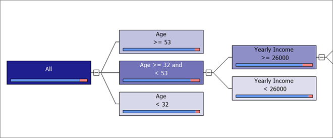
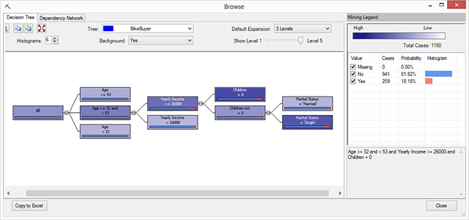
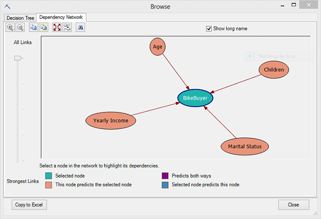
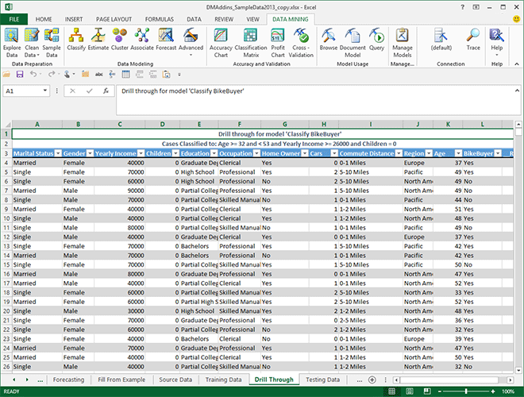

# Browsing a Decision Trees Model
  When you open a classification model using **Browse**, the model is displayed in an interactive decision tree viewer, similar to the [!INCLUDE[msCoName](../includes/msconame-md.md)] Decision Trees viewer in [!INCLUDE[ssASnoversion](../includes/ssasnoversion-md.md)]. The viewer displays the results of classification as a graph that is designed to highlight the criteria that differentiate one group of data from another. You can also drill down into individual subsets of the tree and retrieve the underlying data.  
  
##   Explore the Model  
 Models based on the Decision Trees algorithm have lots of interesting information to explore. The **Browse** window includes the following tabs and panes to help you learn the patterns and predict outcomes using the graph:  
  
-   [Decision Tree](#BKMK_DecisionTree)  
  
-   [Dependency Network](#BKMK_DNetwork)  
  
 To experiment with a decision trees model, you can use the sample data on the Training Data (or Source Data) tab of the sample data workbook, and build a decision tree model using Bike Buyer as the predictable attribute.  
  
###   Decision Tree  
 This view is intended to help you understand and explore the factors that lead to an outcome.  
  
 The decision tree graph can be read from left to right as follows:  
  
-   The rectangles, which are referred to as *nodes*, contain subsets of the data. The label on the node tells you the defining characteristics of that subset.  
  
-   The leftmost node, labeled **All**, represents the complete data set. All subsequent nodes represent subsets of the data.  
  
-   A decision tree contains many *splits*, or places where the data diverges into multiple sets based on attributes.  
  
     For example, the first split in the sample model divides the dataset into three groups by age.  
  
-   The split immediately after the **All** node is most important because it shows the primary condition that divides this dataset.  
  
     Additional splits occur to the right. Thus, by analyzing different segments of the tree, you can learn which attributes had the most influence on purchasing behavior.  
  
   
  
 Using this information, you might focus a marketing campaign on customers that might simply need encouragement to make a purchase.  
  
##### Explore the decision tree  
  
1.  Click the **All** node, and look at the **Mining Legend**.  
  
     It displays the exact count of cases in the training data set, as well as a breakdown of the outcomes.  
  
     You can view the same information in a tooltip if you pause the mouse over a node.  
  
2.  Click the plus and minus signs next to each node to expand or collapse the tree.  
  
     You can also use the **Show Level** slider to expand or shrink the tree.  
  
3.  Notice that some nodes are darker than others?  
  
     By default, **Population** is used as the shading variable, which means that the intensity of the color shows you which nodes have the most support.  
  
     Therefore the leftmost node is darkest, because it contains the entire dataset.  
  
4.  Change the value for **Background** from **All Cases** to **Yes**.  
  
       
  
5.  Now the intensity of the color tells you how many customers in each node purchased a bike, which is the behavior you are interested in.  
  
     Notice the colored bars within each node. This is a histogram that shows the distribution of outcomes within this subset of data. For example, in the sample Bike Buyer decision tree, the colored bar shows the proportion of customers who bought bikes (Yes values) vs. those who did not (No values). To get the exact values, you can click the node and view the **Mining Legend**.  
  
6.  By following the graph, you can see how each subset of data is further decomposed into smaller groups, and which attributes are most useful in predicting an outcome.  
  
     Just by looking at the intensity of the shading, you can focus on a couple groups of interest, and get more detailed data on them for comparison. For example, these groups have a fairly high probability of buying bikes:  
  
    -   Age >= 32 and \< 53 and Yearly Income >= 26000 and Children = 0  
  
         Total cases: 1150  
  
         Bike buyer probability: 18%  
  
    -   Age >= 32 and \< 53 and Yearly Income >= 26000 and Children not = 0 and Marital Status = 'Single'  
  
         Total cases: 402  
  
         Bike buyer probability: 16%  
  
7.  Change the value for **Background** from **Yes** to **No** and see how the graph changes.  
  
       
  
 **Tips**  
  
-   If your data can be divided into multiple series, a different model is built for each set of data that you want to model.  
  
-   In the sample data model, there is only one predictable outcome – Bike Buyer – but suppose you had information about whether the customer purchased a service plan and wanted to predict that as well. In that case you would have that data in a separate column, and include two predictable attributes in the model.  
  
     Click the **Histogram** option, in the upper left corner of the Decision Tree pane, to change the maximum number of states that can appear in the histograms in the tree. This is useful if the predictable attribute has many states. The states appear in a histogram in order of popularity from left to right.  
  
-   You can also use the options on the **Decision Tree** tab to affect how the tree is displayed, by zooming in or out, or sizing the graph to fit the window.  
  
-   Use **Default Expansion** to set the default number of levels that are displayed for all trees in the model.  
  
-   Select **Show long name** to display the full name of the attribute, including the data source. Short names and long names are the same unless your cases are obtained from a different data source than the attributes for each case.  
  
 [Back To Top](#bkmk_Top)  
  
###   Dependency Network  
 The **Dependency Network** view displays the connections between the input attributes and the predictable attributes in the model.  
  
1.  Click and drag the slider at the left of the viewer  
  
     At the top position, all connections are shown. When you drag the slider down, only the strongest links are shown in the viewer.  
  
2.  Now click the Bike Buyer node.  
  
       
  
     When you select a node, the viewer highlights the dependencies that are specific to the node. In this case, the viewer highlights each node that helps predict the outcome.  
  
3.  If the viewer contains many nodes, you can search for specific nodes by using the **Find Node** button. Clicking **Find Node** opens the **Find Node** dialog box, in which you can use a filter to search for and select specific nodes.  
  
4.  The legend at the bottom of the viewer links color codes to the type of dependency in the graph. For example, when you select a predictable node, the predictable node is shaded turquoise, and the nodes that predict the selected node are shaded orange.  
  
 [Back To Top](#bkmk_Top)  
  
### Drill through to Underlying Data  
 Several types of models support the ability to *drill through* from the model to the underlying case data. This can be very useful if you want to contact customers in a particular segment or pull out the data to perform further analysis.  
  
##### Get case data  
  
1.  Right-click the node in the tree that contains the desired data and select one of these options:  
  
    -   **Drill Through Model**. This option gets the cases that belong to the selected node, and saves them to a table in Excel. You get back only the columns of data that were actually used in building the model.  
  
    -   **Drill Through Structure Columns**. This option gets the cases that belong to the selected node, and saves them to a table in Excel. You get all information that was available in the underlying data when you built it, even of a column wasn’t used in the model. For example, you might have excluded the customer address and zip code because those fields are not useful with analysis, but left them in the structure.  
  
     Return to Excel to view your data. The Browse viewer runs a query, saves the data to a table in a new worksheet, and labels the results.  
  
       
  
## See Also  
 [Browsing Models in Excel &#40;SQL Server Data Mining Add-ins&#41;](browsing-models-in-excel-sql-server-data-mining-add-ins.md)  
  
  
