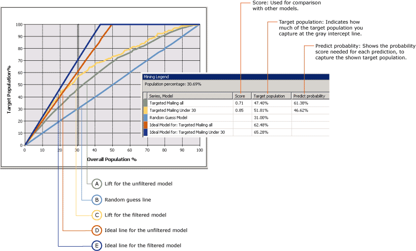
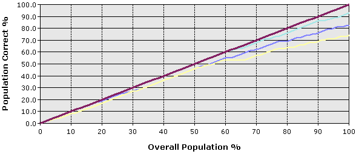

# Lift Chart (Analysis Services - Data Mining)
  A **Lift Chart** graphically represents the improvement that a mining model provides when compared against a random guess, and measures the change in terms of a *lift* score. By comparing the lift scores for various portions of your data set and for different models, you can determine which model is best, and which percentage of the cases in the data set would benefit from applying the model’s predictions.  
  
 With a lift chart, you can compare the accuracy of predictions for multiple models that have the same predictable attribute. You can also assess the accuracy of prediction either for a single outcome (a single value of the predictable attribute), or for all outcomes (all values of the specified attribute).  
  
 A profit chart is a related chart type that contains the same information as a lift chart, but also displays the projected increase in profit that is associated with using each model.  
  
##   Understanding the Lift Chart  
 It can be hard to understand lift charts in the abstract. Therefore, to illustrate the use of the lift chart tools and the information in the chart, this section presents a scenario in which a lift chart is used to estimate the response to a targeted mailing campaign.  
  
 The marketing department in this scenario knows that a 10 percent response rate is more or less typical of mailing campaigns. They have a list of 10,000 potential customers stored in a table in the database. Based on the typical response rate, they could normally expect only about 1,000 of the potential customers to respond. However, the money budgeted for the project is not enough to reach all 10,000 customers in the database, and they want to improve their response rate. Assume for this scenario that their budget allows them to mail an advertisement to only 5,000 customers. The marketing department has two options:  
  
-   Randomly select 5,000 customers to target.  
  
-   Use a mining model to target the 5,000 customers who are most likely to respond.  
  
 By using a lift chart, you can compare the expected results of both options. For example, if the company randomly selected 5,000 customers, they might expect to receive only 500 responses, based on the typical response rate. This scenario is what the *random* line in the lift chart represents. However, if the marketing department used a mining model to target their mailing, they could expect a better response rate because the model would identify those customers who are most likely to respond. If the model were perfect, it would create predictions that are never wrong, and the company could expect to receive 1,000 responses by sending the mailing just to the 1,000 potential customers recommended by the model. This scenario is what the *ideal* line in the lift chart represents.  
  
 The reality is that the mining model most likely falls between these two extremes; between a random guess and a perfect prediction. Any improvement from the random guess is considered to be lift.  
  
 When you create a lift chart, you can target a specific value and measure lift only for that outcome, or you can create a general assessment of the model that measures lifts for all possible outcomes. These selections affect the final chart, as described in the following sections.  
  
 [Back to Top](#bkmk_Top)  
  
### Lift Chart with Target Value  
 The following chart shows a lift chart for the **Targeted Mailing** model that you create in the [Basic Data Mining Tutorial](../../tutorials/basic-data-mining-tutorial.md). In this chart, the target attribute is [Bike Buyer] and the target value is 1, meaning that the customer is predicted to buy a bike. The lift chart thus shows the improvement the model provides when identifying these potential customers.  
  
 This chart contains multiple models based on the same data. One of these models has been customized to target specific customers. You can customize a model by adding filters on the data used to train the mode. This filter restricts the cases used in both training and evaluation to customers who are under the age of 30. Notice that one effect of filtering is that the basic model and the filtered model use different data sets, and therefore the number of cases used for evaluation in the lift chart is different as well. This point is important to remember when you interpret the prediction results and other statistics.  
  
   
  
 The x-axis of the chart represents the percentage of the test dataset that is used to compare the predictions. The y-axis of the chart represents the percentage of predicted values.  
  
 The diagonal straight line, shown here in blue, appears in every chart. It represents the results of random guessing, and is the baseline against which to evaluate lift. For each model that you add to a lift chart, you get two additional lines: one line shows the ideal results for the training data set if you could create a model that always predicted perfectly, and the second line shows the actual lift, or improvement in results, for the model.  
  
 In this example, the ideal line for the filtered model is shown in dark blue, and the line for actual lift in yellow. You can tell from the chart that the ideal line peaks at around 40 percent, meaning that if you had a perfect model, you could reach 100 percent of your targeted customers by sending a mailing to only 40% of the total population. The actual lift for the filtered model when you target 40 percent of the population is between 60 and 70 percent, meaning you could reach 60-70 percent of your targeted customers by sending the mailing to 40 percent of the total customer population.  
  
 The **Mining Legend** contains the actual values at any point on the curves. You can change the place that is measured by clicking the vertical gray bar and moving it. In the chart, the gray line has been moved to 30 percent, because this is the point where both the filtered and unfiltered models appear to be most effective, and after this point the amount of lift declines.  
  
 The **Mining Legend** also contains scores and statistics that help you interpret the chart. These results represent the accuracy of the model at the gray line, which in this scenario is positioned to include 30 percent of the overall test cases.  
  
|Series and  model|Score|Target population|Predict probability|  
|-----------------------|-----------|-----------------------|-------------------------|  
|Targeted mailing all|0.71|47.40%|61.38%|  
|Targeted mailing under 30|0.85|51.81%|46.62%|  
|Random guess model||31.00%||  
|Ideal model for: Targeted mailing all||62.48%||  
|Ideal model for: Targeted mailing under 30||65.28%||  
  
 [Back to Top](#bkmk_Top)  
  
#### Interpreting the Results  
 From these results, you can see that, when measured at 30 percent of all cases, the general model, [Targeted mailing all], can predict the bike buying behavior of 47.40% of the target population. In other words, if you sent out a targeted mailing to only 30 percent of the customers in your database, you could reach slightly less than half of your target audience. If you used the filtered model, you could get slightly better results, and reach about 51 percent of your targeted customers.  
  
 The value for **Predict probability** represents the threshold required to include a customer among the "likely to buy" cases. For each case, the model estimates the accuracy of each prediction and stores that value, which you can use to filter out or to target customers. For example, to identify the customers from the basic model who are likely buyers, you would use a query to retrieve cases with a Predict probability of at least 61 percent. To get the customers targeted by the filtered model, you would create query that retrieved cases that met all the criteria: age and a `PredictProbability` value of at least 46 percent.  
  
 It is interesting to compare the models. The filtered model appears to capture more potential customers, but when you target customers with a prediction probability score of 46 percent, you also have a 53 percent chance of sending a mailing to someone who will not buy a bike. Therefore, if you were deciding which model is better, you would want to balance the greater precision and smaller target size of the filtered model against the selectiveness of the basic model.  
  
 The value for **Score** helps you compare models by calculating the effectiveness of the model across a normalized population. A higher score is better, so in this case you might decide that targeting customers under 30 is the most effective strategy, despite the lower prediction probability.  
  
 [Back to Top](#bkmk_Top)  
  
### Lift Chart for Model with No Target Value  
 If you do not specify the state of the predictable column, you create the type of chart shown in the following diagram. This chart shows how the model performs for all states of the predictable attribute. For example, this chart would tell you how well the model predicts both customers who are likely to buy a bike, and those who are unlikely to buy a bike.  
  
 The x-axis is the same as in the chart with the predictable column specified, but the y-axis now represents the percentage of predictions that are correct. Therefore, the ideal line is the diagonal line, which shows that at 50 percent of the data, the model correctly predicts 50% of the cases, the maximum that can be expected.  
  
   
  
 You can click in the chart to move the vertical gray bar, and the **Mining Legend** displays the percentage of cases overall, and the percentage of cases that were predicted correctly. For example, if you position the gray slider bar at the 50 percent mark, the **Mining Legend** displays the following accuracy scores. These figures are based on the TM_Decision Tree model created in the Basic Data Mining Tutorial.  
  
|Series, model|Score|Target population|Predict probability|  
|-------------------|-----------|-----------------------|-------------------------|  
|TM_Decision Tree|0.77|40.50%|72.91%|  
|Ideal model||50.00%||  
  
 This table tells you that, at 50 percent of the population, the model that you created correctly predicts 40 percent of the cases. You might consider this a reasonably accurate model. However, remember that this particular model predicts all values of the predictable attribute. Therefore, the model might be accurate in predicting that 90 percent of customers will not buy a bike.  
  
 [Back to Top](#bkmk_Top)  
  
### Restrictions on Lift Charts  
 Lift charts require that the predictable attribute be a discrete value. In other words, you cannot use lift charts to measure the accuracy of models that predict continuous numeric values.  
  
 The prediction accuracy for all discrete values of the predictable attribute is shown in a single line. If you want to see prediction accuracy lines for any individual value of the predictable attribute, you must create a separate lift chart for each targeted value.  
  
 You can add multiple models to a lift chart, as long as the models all have the same predictable attribute. Models that do not share the attribute will be unavailable for selection in the **Input** tab.  
  
 You cannot display time series models in a lift chart or profit chart. A common practice for measuring the accuracy of time series predictions is to reserve a portion of historical data and compare that data to the predictions. For more information, see [Microsoft Time Series Algorithm](microsoft-time-series-algorithm.md).  
  
### Related Content  
 [Back to Top](#bkmk_Top)  
  
## See Also  
 [Testing and Validation &#40;Data Mining&#41;](testing-and-validation-data-mining.md)  
  
  
