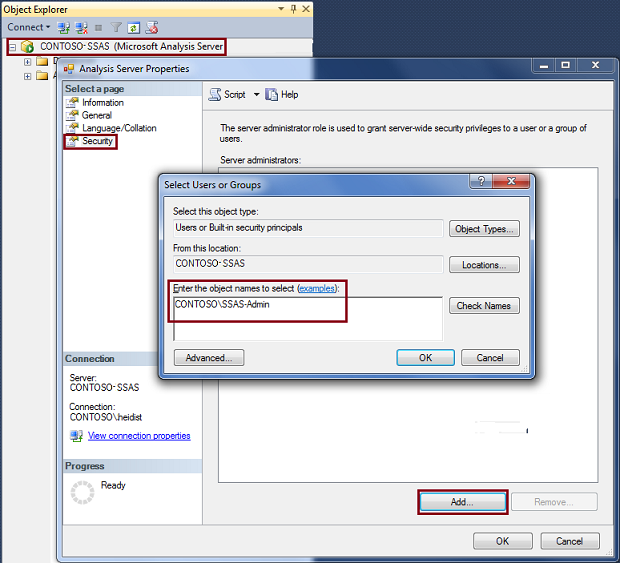

# Grant Server Administrator Permissions (Analysis Services)
  Members of the Server administrator role within an instance of [!INCLUDE[ssASnoversion](../../includes/ssasnoversion-md.md)] have unrestricted access to all [!INCLUDE[ssASnoversion](../../includes/ssasnoversion-md.md)] objects and data in that instance. A user must be a member of the Server administrator role to perform any server-wide task, such as creating or processing a database, modifying server properties, or launching a trace (other than for processing events).  
  
 Role membership is established when [!INCLUDE[ssASnoversion](../../includes/ssasnoversion-md.md)] is installed. The user running the Setup program can add him or herself to the role, or add another user, when provisioning the server. You can modify role membership as a post-installation task using the following procedure.  
  
## Modify Server Role Membership  
  
1.  In [!INCLUDE[ssManStudioFull](../../includes/ssmanstudiofull-md.md)], connect to the instance of [!INCLUDE[ssASnoversion](../../includes/ssasnoversion-md.md)], and then right-click the instance name in Object Explorer and then click **Properties**.  
  
2.  Click **Security** in the **Select a Page** pane, and then click **Add** at the bottom of the page to add one or more Windows users or groups to the server role.  
  
       
  
 At installation time, SQL Server Setup requires that you specify at least one user account as the Analysis Services system administrator.  
  
 By default, members of the local Administrators group are also granted administrative rights in Analysis Server. Although the local group is not explicitly granted membership in the [!INCLUDE[ssASnoversion](../../includes/ssasnoversion-md.md)] server administrator role, local administrators can create databases, add users and permissions, and perform any other task allowed to system administrators. This behavior is configurable. It is determined by the `BuiltinAdminsAreServerAdmins` server property, which is set to **true** by default. You can change this property in [!INCLUDE[ssManStudioFull](../../includes/ssmanstudiofull-md.md)]. For more information, see [Security Properties](../server-properties/security-properties.md).  
  
 You can also manage server roles by using Analysis Management Objects (AMO). For more information, see [Developing with Analysis Management Objects &#40;AMO&#41;](../multidimensional-models/analysis-management-objects/developing-with-analysis-management-objects-amo.md).  
  
## See Also  
 [Authorizing access to objects and operations &#40;Analysis Services&#41;](../multidimensional-models/authorizing-access-to-objects-and-operations-analysis-services.md)   
 [Security Roles  &#40;Analysis Services - Multidimensional Data&#41;](../multidimensional-models/olap-logical/security-roles-analysis-services-multidimensional-data.md)  
  
  
