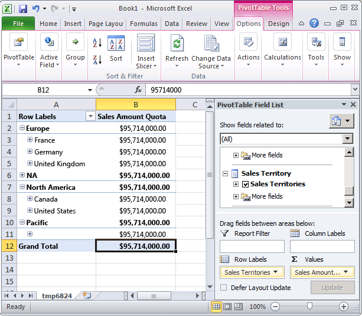
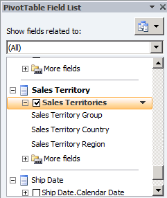
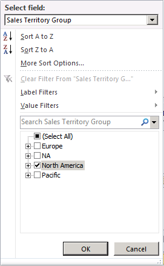
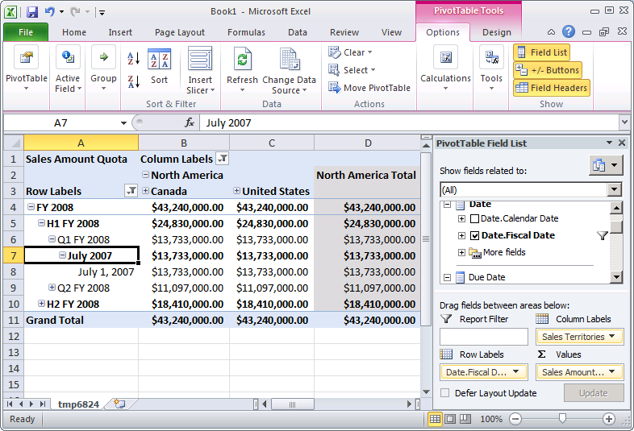
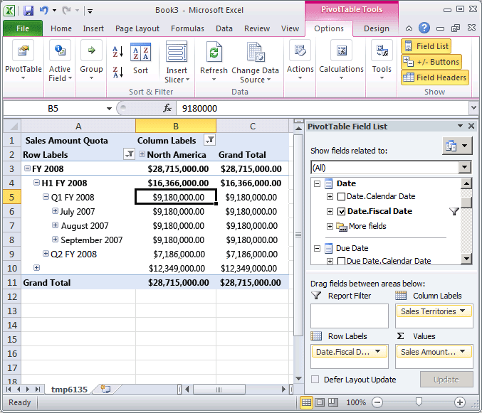

# Defining Dimension Granularity within a Measure Group
  Users will want to dimension fact data at different granularity or specificity for different purposes. For example, sales data for reseller or internet sales may be recorded for each day, whereas sales quota information may only exist at the month or quarter level. In these scenarios, users will want a time dimension with a different grain or level of detail for each of these different fact tables. While you could define a new database dimension as a time dimension with this different grain, there is an easier way with [!INCLUDE[ssASnoversion](../includes/ssasnoversion-md.md)].  
  
 By default in [!INCLUDE[ssASnoversion](../includes/ssasnoversion-md.md)], when a dimension is used within a measure group, the grain of the data within that dimension is based on the key attribute of the dimension. For example, when a time dimension is included within a measure group and the default grain of the time dimension is daily, the default grain of that dimension within the measure group is daily. Many times this is appropriate, such as for the **Internet Sales** and **Reseller Sales** measure groups in this tutorial. However, when such a dimension is included in other types of measure groups, such as in a sales quota or budget measure group, a monthly or quarterly grain is generally more appropriate.  
  
 To specify a grain for a cube dimension other than the default grain, you modify the granularity attribute for a cube dimension as used within a particular measure group on the **Dimension Usage** tab of Cube Designer. When you change the grain of a dimension within a specific measure group to an attribute other than the key attribute for that dimension, you must guarantee that all other attributes in the measure group are directly or indirectly related to new granularity attribute. You do this by specifying attribute relationships between all other attributes and the attribute that is specified as the granularity attribute in the measure group. In this case, you define additional attribute relationships rather than move attribute relationships. The attribute that is specified as the granularity attribute effectively becomes the key attribute within the measure group for the remaining attributes in the dimension. If you do not specify attribute relationships appropriately, [!INCLUDE[ssASnoversion](../includes/ssasnoversion-md.md)] will not be able to aggregate values correctly, as you will see in the tasks in this topic.  
  
 For more information, see [Dimension Relationships](multidimensional-models-olap-logical-cube-objects/dimension-relationships.md), [Define a Regular Relationship and Regular Relationship Properties](multidimensional-models/define-a-regular-relationship-and-regular-relationship-properties.md).  
  
 In the tasks in this topic, you add a Sales Quotas measure group and define the granularity of the Date dimension in this measure group to be monthly. You then define attribute relationships between the month attribute and other dimension attributes to ensure that [!INCLUDE[ssASnoversion](../includes/ssasnoversion-md.md)] aggregates values correctly.  
  
## Adding Tables and Defining the Sales Quotas Measure Group  
  
1.  Switch to the **Adventure Works DW 2012** data source view.  
  
2.  Right-click anywhere in the **Diagram Organizer** pane, click **New Diagram**, and then name the diagram `Sales Quotas`.  
  
3.  Drag the **Employee**, **Sales Territory**, and `Date` tables from the **Tables** pane to the **Diagram** pane.  
  
4.  Add the **FactSalesQuota** table to the **Diagram** pane by right-clicking anywhere in the **Diagram** pane and selecting **Add/Remove Tables**.  
  
     Notice that the **SalesTerritory** table is linked to the **FactSalesQuota** table through the **Employee** table.  
  
5.  Review the columns in the **FactSalesQuota** table and then explore the data in this table.  
  
     Notice that the grain of the data within this table is the calendar quarter, which is the lowest level of detail in the FactSalesQuota table.  
  
6.  In Data Source View Designer, change the **FriendlyName** property of the **FactSalesQuota** table to `SalesQuotas`.  
  
7.  Switch to the [!INCLUDE[ssASnoversion](../includes/ssasnoversion-md.md)] Tutorial cube, and then click the **Cube Structure** tab.  
  
8.  Right-click anywhere in the **Measures** pane, click **New Measure Group**, click `SalesQuotas` in the **New Measure Group** dialog box, and then click **OK**.  
  
     The `Sales Quotas` measure group appears in the **Measures** pane. In the **Dimensions** pane, notice that a new `Date` cube dimension is also defined, based on the `Date` database dimension. A new time-related cube dimension is defined because [!INCLUDE[ssASnoversion](../includes/ssasnoversion-md.md)] does not know which of the existing time-related cube dimensions to relate to the **DateKey** column in the **FactSalesQuota** fact table that underlies the Sales Quotas measure group. You will change this later in another task in this topic.  
  
9. Expand the `Sales Quotas` measure group.  
  
10. In the **Measures** pane, select **Sales Amount Quota**, and then set the value for the **FormatString** property to **Currency** in the Properties window.  
  
11. Select the **Sales Quotas Count** measure, and then type `#,#` as the value for the **FormatString** property in the Properties window.  
  
12. Delete the **Calendar Quarter** measure from the `Sales Quotas` measure group.  
  
     [!INCLUDE[ssASnoversion](../includes/ssasnoversion-md.md)] detected the column that underlies the Calendar Quarter measure as a column that contains measures. However, this column and the CalendarYear column contain the values that you will use to link the Sales Quotas measure group to the Date dimension later in this topic.  
  
13. In the **Measures** pane, right-click the `Sales Quotas` measure group, and then click **New Measure**.  
  
     The **New Measure** dialog box opens, containing the available source columns for a measure with a usage type of **Sum**.  
  
14. In the **New Measure** dialog box, select **Distinct count** in the **Usage** list, verify that `SalesQuotas` is selected in the **Source table** list, select **EmployeeKey** in the **Source column** list, and then click **OK**.  
  
     Notice that the measure is created in a new measure group named **Sales Quotas 1**. Distinct count measures in [!INCLUDE[ssNoVersion](../includes/ssnoversion-md.md)] are created in their own measure groups to maximize processing performance.  
  
15. Change the value for the **Name** property for the **Employee Key Distinct Count** measure to `Sales Person Count`, and then type `#,#` as the value for the **FormatString** property.  
  
## Browsing the Measures in the Sales Quota Measure Group by Date  
  
1.  On the **Build** menu, click **Deploy Analysis Services Tutorial**.  
  
2.  When deployment has successfully completed, click the **Browser** tab in Cube Designer for the [!INCLUDE[ssASnoversion](../includes/ssasnoversion-md.md)] Tutorial cube, and then click the **Reconnect** button.  
  
3.  Click the Excel shortcut, and then click **Enable**.  
  
4.  In the PivotTable Field List, expand the `Sales Quotas` measure group, and then drag the **Sales Amount Quota** measure to the Values area.  
  
5.  Expand the **Sales Territory** dimension, and then drag the **Sales Territories** user-defined hierarchy to Row Labels.  
  
     Notice that the Sales Territory cube dimension is not related, directly or indirectly, to the Fact Sales Quota table, as shown in the following image.  
  
       
  
     In the next series of steps in this topic you will define a reference dimension relationship between this dimension and this fact table.  
  
6.  Move the **Sales Territories** user hierarchy from the Rows Labels area to the Column Labels area.  
  
7.  In the PivotTable Field list, select the **Sales Territories** user-defined hierarchy, and then click the down arrow to the right.  
  
       
  
8.  In the filter, click the Select All checkbox to clear all the selections, and then choose just **North America**.  
  
       
  
9. In the PivotTable Field List, expand `Date`.  
  
10. Drag the **Date.Fiscal Date** user hierarchy to Row Labels  
  
11. On the PivotTable, click the down arrow next to Row Labels. Clear all of the years except for **FY 2008**.  
  
     Notice that only the **July 2007** member of the **Month** level appears, instead of the **July, 2007**, **August, 2007**, and **September, 2007** members of **Month** level, and that only the **July 1, 2007** member of the `Date` level appears, instead of all 31 days. This behavior occurs because the grain of the data in the fact table is at the quarter level and the grain of the `Date` dimension is the daily level. You will change this behavior in the next task in this topic.  
  
     Notice also that the **Sales Amount Quota** value for the month and day levels is the same value as for the quarter level, $13,733,000.00. This is because the lowest level of data in the Sales Quotas measure group is at the quarter level. You will change this behavior in Lesson 6.  
  
     The following image shows the values for **Sales Amount Quota**.  
  
       
  
## Defining Dimension Usage Properties for the Sales Quotas Measure Group  
  
1.  Open Dimension Designer for the **Employee** dimension, right-click **SalesTerritoryKey** in the **Data Source View** pane, and then click **New Attribute from Column**.  
  
2.  In the **Attributes** pane, select **SalesTerritoryKey**, and then set the **AttributeHierarchyVisible** property to **False** in the Properties window, set the **AttributeHierarchyOptimizedState** property to **NotOptimized**, and set the **AttributeHierarchyOrdered** property to **False**.  
  
     This attribute is required to link the **Sales Territory** dimension to the `Sales Quotas` and **Sales Quotas 1** measure groups as a referenced dimension.  
  
3.  In Cube Designer for the [!INCLUDE[ssASnoversion](../includes/ssasnoversion-md.md)] Tutorial cube, click the **Dimension Usage** tab, and then review the dimension usage within the `Sales Quotas` and **Sales Quotas 1** measure groups.  
  
     Notice that the **Employee** and `Date` cube dimensions are linked to the **Sales Quotasand Sales Quotas 1** measure groups through regular relationships. Notice also that the **Sales Territory** cube dimension is not linked to either of these measure groups.  
  
4.  Click the cell at the intersection of the **Sales Territory** dimension and the `Sales Quotas` measure group and then click the browse button (**…**). The **Define Relationship** dialog box opens.  
  
5.  In the **Select relationship type** list, select **Referenced**.  
  
6.  In the **Intermediate dimension** list, select **Employee**.  
  
7.  In the **Reference dimension attribute** list, select **Sales Territory Region.**  
  
8.  In the **Intermediate dimension attribute** list, select **Sales Territory Key**. (The key column for the Sales Territory Region attribute is the SalesTerritoryKey column.)  
  
9. Verify that the **Materialize** check box is selected.  
  
10. Click **OK**.  
  
11. Click the cell at the intersection of the **Sales Territory** dimension and the **Sales Quotas 1** measure group and then click the browse button (**…**). The **Define Relationship** dialog box opens.  
  
12. In the **Select relationship type** list, select **Referenced**.  
  
13. In the **Intermediate dimension** list, select **Employee**.  
  
14. In the **Reference dimension attribute** list, select **Sales Territory Region.**  
  
15. In the **Intermediate dimension attribute** list, select **Sales Territory Key**. (The key column for the Sales Territory Region attribute is the SalesTerritoryKey column.)  
  
16. Verify that the **Materialize** check box is selected.  
  
17. Click **OK**.  
  
18. Delete the `Date` cube dimension.  
  
     Instead of having four time-related cube dimensions, you will use the **Order Date** cube dimension in the `Sales Quotas` measure group as the date against which sales quotas will be dimensioned. You will also use this cube dimension as the primary date dimension in the cube.  
  
19. In the **Dimensions** list, rename the **Order Date** cube dimension to `Date`.  
  
     Renaming the **Order Date** cube dimension to `Date` makes it easier for users to understand its role as the primary date dimension in this cube.  
  
20. Click the browse button (**…**) in the cell at the intersection of the `Sales Quotas` measure group and the `Date` dimension.  
  
21. In the **Define Relationship** dialog box, select **Regular** in the **Select relationship type** list.  
  
22. In the **Granularity attribute** list, select **Calendar Quarter**.  
  
     Notice that a warning appears to notify you that because you have selected a non-key attribute as the granularity attribute, you must make sure that all other attributes are directly or indirectly related to the granularity attribute by specifying them as member properties.  
  
23. In the **Relationship** area of the **Define Relationship** dialog box, link the **CalendarYear** and **CalendarQuarter** dimension columns from the table that underlies the Date cube dimension to the **CalendarYear** and **CalendarQuarter** columns in the table that underlies the Sales Quota measure group, and then click **OK**.  
  
    > [!NOTE]  
    >  The Calendar Quarter is defined as the granularity attribute for the Date cube dimension in the Sales Quotas measure group, but the Date attribute continues to be the granularity attribute for the Internet Sales and Reseller Sales measure groups.  
  
24. Repeat the previous four steps for the **Sales Quotas 1** measure group.  
  
## Defining Attribute Relationships Between the Calendar Quarter Attribute and the Other Dimension Attributes in the Date Dimension  
  
1.  Switch to **Dimension Designer** for the `Date` dimension, and then click the **Attribute Relationships** tab.  
  
     Notice that although **Calendar Year** is linked to **Calendar Quarter** through the **Calendar Semester** attribute, the fiscal calendar attributes are linked only to one another; they are not linked to the **Calendar Quarter** attribute and therefore will not aggregate correctly in the `Sales Quotas` measure group.  
  
2.  In the diagram, right-click the **Calendar Quarter** attribute and then select **New Attribute Relationship**.  
  
3.  In the **Create Attribute Relationship** dialog box, the **Source Attribute** is **Calendar Quarter**. Set the **Related Attribute** to **Fiscal Quarter**.  
  
4.  Click **OK**.  
  
     Notice that a warning message appears stating that the `Date` dimension contains one or more redundant attribute relationships that may prevent data from being aggregated when a non-key attribute is used as a granularity attribute.  
  
5.  Delete the attribute relationship between the **Month Name** attribute and the **Fiscal Quarter** attribute.  
  
6.  On the **File** menu, click **Save All**.  
  
## Browsing the Measures in the Sales Quota Measure Group by Date  
  
1.  On the **Build** menu, click **Deploy Analysis Services Tutorial**.  
  
2.  When deployment has successfully completed, click the **Browser** tab in Cube Designer for the [!INCLUDE[ssASnoversion](../includes/ssasnoversion-md.md)] Tutorial cube, and then click **Reconnect**.  
  
3.  Click the Excel shortcut, and then click **Enable**.  
  
4.  Drag the **Sales Amount Quota** measure to the Values area.  
  
5.  Drag the **Sales Territories** user hierarchy to the Column Labels, and then filter on **North America**.  
  
6.  Drag the **Date.FiscalDate** user hierarchy to the Row Labels, and then click the down arrow next to **Row Labels** on the PivotTable, and clear all check boxes other than **FY 2008**, to display only fiscal year 2008.  
  
7.  Click OK.  
  
8.  Expand **FY 2008**, expand **H1 FY 2008**, and then expand **Q1 FY 2008**.  
  
     The following image shows a PivotTable for the [!INCLUDE[ssASnoversion](../includes/ssasnoversion-md.md)] Tutorial cube, with the Sales Quota measure group dimensioned correctly.  
  
     Notice that each member of the fiscal quarter level has the same value as the quarter level. Using **Q1 FY 2008** as an example, the quota of $9,180,000.00 for **Q1 FY 2008** is also the value for each of its members. This behavior occurs because the grain of the data in the fact table is at the quarter level and the grain of the Date dimension is also at the quarter level. In Lesson 6, you will learn how to allocate the quarterly amount proportionally to each month.  
  
       
  
## Next Lesson  
 [Lesson 6: Defining Calculations]((lesson-6-defining-calculations.md)  
  
## See Also  
 [Dimension Relationships](multidimensional-models-olap-logical-cube-objects/dimension-relationships.md)   
 [Define a Regular Relationship and Regular Relationship Properties](multidimensional-models/define-a-regular-relationship-and-regular-relationship-properties.md)   
 [Work with Diagrams in Data Source View Designer &#40;Analysis Services&#41;](multidimensional-models/work-with-diagrams-in-data-source-view-designer-analysis-services.md)  
  
  
