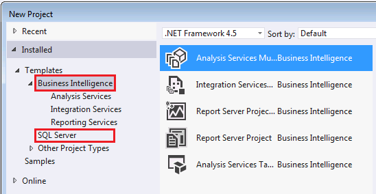

# Tools and applications used in Analysis Services
  Find the tools and applications you'll need for building Analysis Services models, and managing the associated databases on an Analysis Services instance.  
  
## Analysis Services Model Designers  
 Tabular and multidimensional models are created from project templates in a solution built inside the Visual Studio shell. The project template provides the designers for creating models, cubes, dimensions, and roles that comprise an Analysis Services solution.  
  
### Download SQL Server Data Tools for Business Intelligence (SSDT-BI)  
 [!INCLUDE[ssBIDevStudio](../includes/ssbidevstudio-md.md)] for Business Intelligence (SSDT-BI), previously known as Business Intelligence Development Studio (BIDS), is used to create Analysis Services models, Reporting Services reports, and Integration Services packages. You can download SSDT-BI from the following locations:  
  
-   [Download SSDT-BI for Visual Studio 2013](http://go.microsoft.com/fwlink/p/?LinkId=396526)  
  
-   [Download SSDT-BI for Visual Studio 2012](http://go.microsoft.com/fwlink/p/?LinkID=273673)  
  
 If you have a prior version of SSDT-BI or BIDS installed on your computer, the newer version is installed side-by-side the previous version. It's common to run newer and older versions of the design tools on a single workstation so that you can modify projects and solutions tied to specific versions of the server.  
  
> [!NOTE]  
>  There are several download sites for the Visual Studio 2012 and Visual Studio 2013 versions of SSDT. Most do not include the BI project templates. Using the links above will get you the correct version. You’ll know that you have the correct version of SSDT-BI if you see the Business Intelligence project templates folder. This folder contains the project templates for Analysis Services, Reporting Services and Integration Services. Depending on how you installed SSDT-BI, you might also see an additional project template for SQL Server databases.  
  
   
  
## Administrative tools  
  
### SQL Server Management Studio  
 Management Studio is the primary administration tool for all SQL Server features, including Analysis Services. SQL Server Management Studio is an optional component. If you don't see it with other SQL Server applications on the Apps page in Windows Server 2012, run SQL Server Setup to add it to your installation.  
  
### SQL Server Profiler  
 Although it's officially deprecated, SQL Server Profiler provides an easy way to monitor connections, MDX query execution, and other server operations. SQL Server Profiler is installed by default. You can find it with SQL Server applications on Apps in Windows Server 2012.  
  
### PowerShell  
 You can use PowerShell commands to perform many administrative tasks. See [Analysis Services PowerShell](analysis-services-powershell.md) for more information.  
  
### Community and Third-party tools  
 Check the [Analysis Services codeplex page](http://sqlsrvanalysissrvcs.codeplex.com/) for community code samples. [Forums](http://social.msdn.microsoft.com/Forums/sqlserver/home?forum=sqlanalysisservices) can be helpful when seeking recommendations for third-party tools that support Analysis Services.  
  
  
