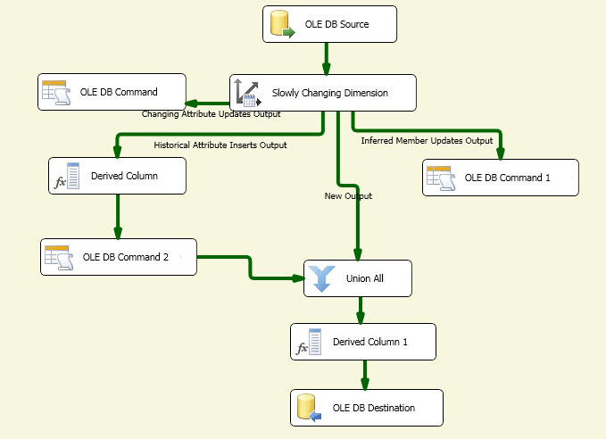

# Configure Outputs Using the Slowly Changing Dimension Wizard
  The Slowly Changing Dimension Wizard functions as the editor for the Slowly Changing Dimension transformation. Building and configuring the data flow for slowly changing dimension data can be a complex task. The Slowly Changing Dimension Wizard offers the simplest method of building the data flow for the Slowly Changing Dimension transformation outputs by guiding you through the steps of mapping columns, selecting business key columns, setting column change attributes, and configuring support for inferred dimension members.  
  
 You must choose at least one business key column in the dimension table and map it to an input column. The value of the business key links a record in the source to a record in the dimension table. The transformation uses this mapping to locate the record in the dimension table and to determine whether a record is new or changing. The business key is typically the primary key in the source, but it can be an alternate key as long as it uniquely identifies a record and its value does not change. The business key can also be a composite key, consisting of multiple columns. The primary key in the dimension table is usually a surrogate key, which means a numeric value generated automatically by an identity column or by a custom solution such as a script.  
  
 Before you can run the Slowly Changing Dimension Wizard, you must add a source and a Slowly Changing Dimension transformation to the data flow, and then connect the output from the source to the input of the Slowly Changing Dimension transformation. Optionally, the data flow can include other transformations between the data source and the Slowly Changing Dimension transformation.  
  
 To open the Slowly Changing Dimension Wizard in [!INCLUDE[ssIS](../../../includes/ssis-md.md)] Designer, double-click the Slowly Changing Dimension transformation.  
  
## Creating Slowly Changing Dimension Outputs  
  
#### To create Slowly Changing Dimension transformation outputs  
  
1.  Choose the connection manager to access the data source that contains the dimension table that you want to update.  
  
     You can select from a list of connection managers that the package includes.  
  
2.  Choose the dimension table or view you want to update.  
  
     After you select the connection manager, you can select the table or view from the data source.  
  
3.  Set key attributes on columns and map input columns to columns in the dimension table.  
  
     You must choose at least one business key column in the dimension table and map it to an input column. Other input columns can be mapped to columns in the dimension table as non-key mappings.  
  
4.  Choose the change type for each column.  
  
    -   **Changing attribute** overwrites existing values in records.  
  
    -   **Historical attribute** creates new records instead of updating existing records.  
  
    -   **Fixed attribute** indicates that the column value must not change.  
  
5.  Set fixed and changing attribute options.  
  
     If you configure columns to use the **Fixed attribute** change type, you can specify whether the Slowly Changing Dimension transformation fails when changes are detected in these columns. If you configure columns to use the **Changing attribute** change type, you can specify whether all matching records, including outdated records, are updated.  
  
6.  Set historical attribute options.  
  
     If you configure columns to use the **Historical attribute** change type, you must choose how to distinguish between current and expired records. You can use a current row indicator column or two date columns to identify current and expired rows. If you use the current row indicator column, you can set it to **Current**, **True** when current and **Expired,** or **False** when expired. You can also enter custom values. If you use two date columns, a start date and an end date, you can specify the date to use when setting the date column values by typing a date or by selecting a system variable and then using its value.  
  
7.  Specify support for inferred members and choose the columns that the inferred member record contains.  
  
     When loading measures into a fact table, you can create minimal records for inferred members that do not yet exist. Later, when meaningful data is available, the dimension records can be updated. The following types of minimal records can be created:  
  
    -   A record in which all columns with change types are null.  
  
    -   A record in which a Boolean column indicates the record is an inferred member.  
  
8.  Review the configurations that the Slowly Changing Dimension Wizard builds. Depending on which change types are supported, different sets of data flow components are added to the package.  
  
     The following diagram shows an example of a data flow that supports fixed attribute, changing attribute, and historical attribute changes, inferred members, and changes to matching records.  
  
       
  
## Updating Slowly Changing Dimension Outputs  
 The simplest way to update the configuration of the Slowly Changing Dimension transformation outputs is to rerun the Slowly Changing Dimension Wizard and modify properties from the wizard pages. You can also update the Slowly Changing Dimension transformation using the **Advanced Editor** dialog box or programmatically.  
  
## See Also  
 [Slowly Changing Dimension Transformation](slowly-changing-dimension-transformation.md)  
  
  
