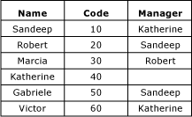
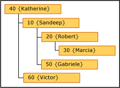
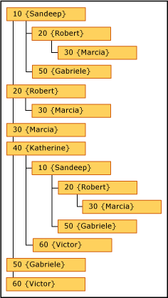

# Recursive Hierarchies (Master Data Services)
  In [!INCLUDE[ssMDSshort](../includes/ssmdsshort-md.md)], a recursive hierarchy is a derived hierarchy that includes a recursive relationship. A recursive relationship exists when an entity has a domain-based attribute based on the entity itself.  
  
## Recursive Hierarchy Example  
 A typical recursive hierarchy example is an organizational structure. In [!INCLUDE[ssMDSshort](../includes/ssmdsshort-md.md)], you would do this by creating an Employee entity with a domain-based attribute called Manager. The Manager attribute is populated from the list of employees. In this sample organization, all employees can be managers.  
  
   
  
 You can create a derived hierarchy that highlights the relationship between the Employee entity and the Manager domain-based attribute.  
  
   
  
 To include each member in the hierarchy only once, you can anchor null relationships. When you do, members with blank domain-based attribute values are displayed at the top level of the hierarchy.  
  
   
  
 If you do not anchor null relationships, members are included multiple times. All members are displayed at the top level. They are also displayed under members of which they are attributes.  
  
   
  
 In this example, Marcia is at the top level. She is not the manager of any employees because she is not used as a domain-based attribute value for any other Employee members. Robert, in contrast, has a level beneath him because Marcia has Robert as her Manager attribute value.  
  
## Rules  
  
-   A derived hierarchy cannot contain more than one recursive relationship. It can, however, have other derived relationships (for example, a derived hierarchy that contains a recursive Manager to Employee relationship can also have Country to Manager and Employee to Store relationships).  
  
-   You cannot assign member permissions (on the **Hierarchy Members** tab) to members in a recursive hierarchy.  
  
-   Recursive hierarchies cannot include circular relationships. For example, Katherine cannot be Sandeep's manager if Sandeep is her manager. Also, Katherine cannot manage herself.  
  
## Related Tasks  
  
|Task Description|Topic|  
|----------------------|-----------|  
|Create a derived hierarchy.|[Create a Derived Hierarchy &#40;Master Data Services&#41;](create-a-derived-hierarchy-master-data-services.md)|  
|Change the name of an existing derived hierarchy.|[Change a Derived Hierarchy Name &#40;Master Data Services&#41;](../../2014/master-data-services/change-a-derived-hierarchy-name-master-data-services.md)|  
|Delete an existing derived hierarchy.|[Delete a Derived Hierarchy &#40;Master Data Services&#41;](../../2014/master-data-services/delete-a-derived-hierarchy-master-data-services.md)|  
  
## Related Content  
  
-   [Domain-Based Attributes &#40;Master Data Services&#41;](../../2014/master-data-services/domain-based-attributes-master-data-services.md)  
  
-   [Derived Hierarchies &#40;Master Data Services&#41;](../../2014/master-data-services/derived-hierarchies-master-data-services.md)  
  
  
