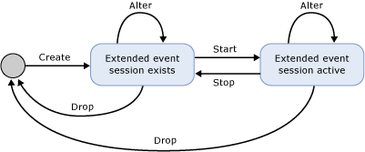
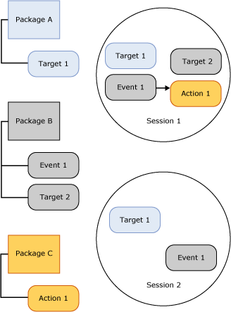

# SQL Server Extended Events Sessions
  A [!INCLUDE[ssNoVersion](../../../includes/ssnoversion-md.md)] Extended Events session is created in the [!INCLUDE[ssNoVersion](../../../includes/ssnoversion-md.md)] process hosting the Extended Events engine. The following aspects of an Extended Events session provide a context for understanding the Extended Events infrastructure and the general processing that takes place:  
  
-   Session states. The different states that an Extended Events session is in when CREATE EVENT SESSION and ALTER EVENT SESSION statements are executed.  
  
-   Session content and characteristics. The content of an Extended Events session, such as targets and events, and how these objects are related in a session or between sessions.  
  
## Session States  
 The following illustration shows the various states of an Extended Events session.  
  
   
  
 Referring to the preceding figure, note that session state changes as the different DDL commands are issued for an event session. The following table describes these changes in state.  
  
|Illustration label|DDL statement|Description|  
|------------------------|-------------------|-----------------|  
|Create|CREATE EVENT SESSION|The host process creates a session object that contains the metadata provided by CREATE EVENT SESSION. The host process validates the session definition, validates the user permission level, and stores the metadata in the master database. At this point the session is not active.|  
|Alter|ALTER EVENT SESSION, STATE=START|The host process starts the session. The host process reads the stored metadata, validates the session definition, verifies the level of user permission level, and creates the session. Session objects, such as events and targets, are loaded and event handling is active.|  
|Alter|ALTER EVENT SESSION, STATE=STOP|The host process stops the active session but retains the metadata.|  
|Drop|DROP EVENT SESSION|Depending on whether or not the session is active, Drop (DROP SESSION) will delete the metadata and close the active session, or delete the session metadata.|  
  
> [!NOTE]  
>  Both ALTER EVENT SESSION and DROP EVENT SESSION can be applied to the metadata or to an active session and the metadata.  
  
## Session Content and Characteristics  
 Extended Event sessions have implied boundaries in that the configuration of one session does not change the configuration of another session. However, these boundaries do not prevent an event or target from being used in more than one session.  
  
 The following illustration shows session content and the relationship between packages and sessions.  
  
   
  
 Referring to the preceding illustration, note that:  
  
-   The mapping between package objects and sessions is many to many, which means that that an object can appear in several sessions, and a session can contain several objects.  
  
-   The same event (Event 1) or target (Target 1) can be enabled in more than one session.  
  
 Sessions have the following characteristics:  
  
-   Actions and predicates are bound to events on a per-session basis. If you have Event 1 in Session A with Action 1 and Predicate Z, this will not in any way affect having Event 1 in Session B with Action 2 and Action 3 with no predicate.  
  
-   Policies are attached to sessions to handle buffering and dispatch, and causality tracking.  
  
 **Buffering and dispatch**  
  
 Buffering refers to how event data is stored while an event session is running.  Buffering policies specify how much memory to use for event data, and the loss policy for the events. Dispatch refers to the amount of time events will stay in buffers before being served to targets for processing.  
  
 **Causality tracking**  
  
 Causality tracking provides the ability to track work across multiple tasks. When causality tracking is enabled, each event fired has a unique activity ID across the system. The activity ID is a combination of a GUID value that remains constant across all events for a task, and a sequence number that is incremented each time an event is fired. When one task causes work to be done on another, the activity ID of the parent is sent to the child task. The child task outputs the parent’s activity ID the first time it fires an event.  
  
 The Extended Events architecture provides a flexible system that allows a variety of objects to be used together to solve specific problems.  
  
## See Also  
 [Extended Events](extended-events.md)  
  
  
