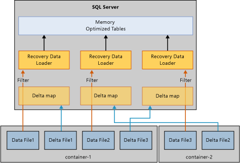

# Restore and Recovery of Memory-Optimized Tables
  The basic mechanism to recover or restore a database with memory-optimized tables is similar to databases with only disk-based tables. But unlike disk-based tables, memory-optimized tables must be loaded into memory before database is available for user access. This adds a new step in the database recovery. The modified steps in database recovery are changed as follows:  
  
 When the [!INCLUDE[ssNoVersion](../../includes/ssnoversion-md.md)] restarts, each database goes through a recovery phase that consists of the following three phases:  
  
1.  The analysis phase. During this phase, a pass is made on the active transaction logs to detect committed and uncommitted transactions. The In-Memory OLTP engine identifies the checkpoint to load and preloads its system table log entries. It will also process some file allocation log records.  
  
2.  The redo phase. This phase is run concurrently on both disk-based and memory-optimized tables.  
  
     For disk-based tables, the database is moved to the current point in time and acquires locks taken by uncommitted transactions.  
  
     For memory-optimized tables, data from the data and delta file pairs are loaded into memory and then update the data with the active transaction log based on the last durable checkpoint.  
  
     When the above operations on disk-based and memory-optimized tables are complete, the database is available for access.  
  
3.  The undo phase. In this phase, the uncommitted transactions are rolled back.  
  
 Loading memory-optimized tables into memory can affect performance of the recovery time objective (RTO). To improve the load time of memory-optimized data from data and delta files, the In-Memory OLTP engine loads the data/delta files in parallel as follows:  
  
-   Creating a Delta Map Filter. Delta files store references to the deleted rows. One thread per container reads the delta files and creates a delta map filter. (A memory optimized data filegroup can have one or more containers.)  
  
-   Streaming the data files.  Once the delta-map filter is created, data files are read using as many threads as there are logical CPUs. Each thread reading the data file reads the data rows, checks the associated delta map and only inserts the row into table if this row has not been marked deleted. This part of recovery can be CPU bound in some cases as noted below.  
  
   
  
 Memory-optimized tables can generally be loaded into memory at the speed of I/O but there are cases when loading data rows into memory will be slower. Specific cases are:  
  
-   Low bucket count for hash index can lead to excessive collision causing data row inserts to be slower. This generally results in very high CPU utilization throughout, and especially towards the end of recovery. If you configured the hash index correctly, it should not impact the recovery time.  
  
-   Large memory-optimized tables with one or more nonclustered indexes, unlike a hash index whose bucket count is sized at create time, the nonclustered indexes grow dynamically, resulting in high CPU utilization.  
  
## Restoring a Database with Memory-optimized tables  
 You know that you have sufficient memory on the server to restore a database, but there's a requirement  that the memory needed by the database is accounted for as part of an existing Resource Pool.  You know that you cannot create the binding to the resource pool before the database exists, so you perform the restore WITH NORECOVERY.  This causes the disk image of the database to be restored and the database to be created, but no In-Memory OLTP memory is consumed because the database is not brought online.  
  
 At this point, you can create the Resource Pool to Database binding, and then use RESTORE WITH RECOVERY to bring the restored database online.  Since the binding is in place before the database is brought online, its In-Memory OLTP memory consumption is properly accounted for. This requires restoring the database only once. The first RESTORE command is an informational command that only reads the backup header, and the last command simply triggers recovery without actually restoring any bits.  
  
## See Also  
 [Backup, Restore, and Recovery of Memory-Optimized Tables](memory-optimized-tables.md)  
  
  
