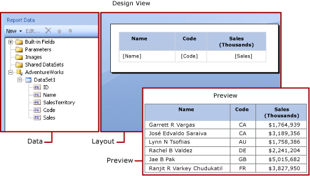
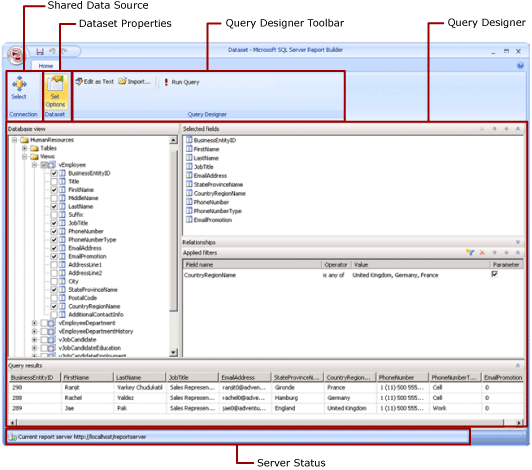

# Add Data to a Report (Report Builder and SSRS)
  To add data to a report, you create datasets. Each dataset represents the result set from running a query command on a data source. The columns in the result set are the field collection. The rows in the result set are the data. A dataset does not contain the actual data. A dataset contains the information that is needed to retrieve a specific set of data from a data source.  
  
 There are two types of datasets: embedded and shared. An embedded dataset is defined in a report and used only by that report. A shared dataset is defined on the report server or SharePoint site and can be used by multiple reports. In Report Builder, you can create shared datasets in Shared Dataset mode or embedded datasets in Report Designer mode. In Report Designer in [!INCLUDE[ssBIDevStudioFull](../../includes/ssbidevstudiofull-md.md)], you can create shared datasets as part of a project or embedded datasets as part of a report.  
  
-   **Embedded datasets.** Unlike applications such as [!INCLUDE[msCoName](../../includes/msconame-md.md)] Office Excel where you work with data directly in a worksheet, in Report Builder or Report Designer you work with metadata that represents the data that will be retrieved when the report is processed. To create an embedded dataset, select the source of data and specify a query. After you create the dataset, use the Report Data pane to view the field collection. You can display data from a dataset in a data region like a table or chart. In each data region, you can group, filter, and sort the data to organize it. After you design the report layout, you run the report to see the actual data.  
  
     In the following figure, the Report Data pane displays a data source named [!INCLUDE[ssSampleDBUserInputNonLocal](../../includes/sssampledbuserinputnonlocal-md.md)], a dataset named DataSet1, and five fields in the dataset field collection. The Layout pane shows a table with the top row of column headings and the bottom row with table cells that contain text. The placeholder text [Name] is the metadata for the field Name. When the report runs, the placeholder text is replaced by the actual data values. The table expands as required to display all the data.  
  
       
  
-   **Shared datasets.** Create a shared dataset when you want to use a dataset in more than one report. To create and save a shared dataset to a report server or SharePoint site, use Report Builder in shared dataset design view. To create a shared dataset as part of a project that can be deployed to a server or site, use Report Designer.  
  
     The following illustration shows Shared Dataset Design view in Report Builder. You can select or modify the data connection, the dataset properties, the query, filters, and optionally mark filters as parameters, and view the query results. You then save the changes back to the server or site.  
  
       
  
 For more information, see [Embedded and Shared Datasets &#40;Report Builder and SSRS&#41;](embedded-and-shared-datasets-report-builder-and-ssrs.md) and [Embedded and Shared Data Connections or Data Sources &#40;Report Builder and SSRS&#41;](../embedded-and-shared-data-connections-or-data-sources-report-builder-and-ssrs.md).  
  
 You can also add datasets to a report by adding report parts that include the datasets they depend on. [!INCLUDE[ssRBrptparts](../../../includes/ssrbrptparts-md.md)]  
  
 To learn how to create a report that displays data from a [!INCLUDE[ssNoVersion](../../includes/ssnoversion-md.md)] database, see [Tutorial: Creating a Basic Table Report &#40;Report Builder&#41;](../tutorial-creating-a-basic-table-report-report-builder.md). To build a report that includes its own data, see [Tutorial: Create a Quick Chart Report Offline &#40;Report Builder&#41;](../report-builder/tutorial-create-a-quick-chart-report-offline-report-builder.md).  
  
> [!NOTE]  
>  [!INCLUDE[ssRBRDDup](../../includes/ssrbrddup-md.md)]  
  
##   Adding Report Data  
 In Report Builder, you can add report data in the following ways.  
  
-   Add report parts from a report server to your report. Each report part is self-contained and includes dependent datasets. The datasets are predefined.  
  
-   Use the Table/Matrix, Chart, and Map wizards. From the wizards, you can select shared data sources and shared datasets, or create new datasets, and continue to design the report.  
  
-   Add shared datasets from a report server. Shared datasets are predefined and specify which data to use from a predefined data source. When you add a shared dataset to your report, you add a dataset reference that points to the shared dataset definition.  
  
 In Report Builder or Report Designer, you can add data in the following ways.  
  
-   Add embedded datasets based on shared data sources.  
  
-   Add embedded datasets based on embedded data sources.  
  
> [!NOTE]  
>  On a report server, shared items are secured individually or by inheriting permissions from the folder where they are published. To enable other users to have access to shared datasets that you save, you must understand how permissions are granted. For more information, see [Security &#40;Report Builder&#41;](../report-builder/security-report-builder.md) or [Secure Shared Dataset Items](../security/secure-shared-dataset-items.md).  
  
 After you add data to a report, you can organize the data on the report page with data regions, modify report parts and share those changes with others, and enable users to limit or sort the data they see in the report. For more information, see the following related topics:  
  
-   [Tables, Matrices, and Lists &#40;Report Builder and SSRS&#41;](../report-design/create-invoices-and-forms-with-lists-report-builder-and-ssrs.md)  
  
-   [Charts &#40;Report Builder and SSRS&#41;](../report-design/charts-report-builder-and-ssrs.md)  
  
-   [Sparklines and Data Bars &#40;Report Builder and SSRS&#41;](../report-design/sparklines-and-data-bars-report-builder-and-ssrs.md)  
  
-   [Indicators &#40;Report Builder and SSRS&#41;](../report-design/indicators-report-builder-and-ssrs.md)  
  
-   [Report Parameters &#40;Report Builder and Report Designer&#41;](../report-design/report-parameters-report-builder-and-report-designer.md)  
  
-   [Report Parts &#40;Report Builder and SSRS&#41;](../report-parts-report-builder-and-ssrs.md)  
  
-   [Filter, Group, and Sort Data &#40;Report Builder and SSRS&#41;](../report-design/filter-group-and-sort-data-report-builder-and-ssrs.md)  
  
  [Back to Top](#BackToTop)  
  
##   Adding Data with Report Parts  
 Report parts contain the datasets that they depend on. These datasets are built on shared data sources that are available on the report server. In Report Builder, when you add a report part to your report, the dependent datasets are added to your report, just as if you had added them manually. For example, a predefined chart contains a dataset. To see the data, preview the report.  
  
> [!NOTE]  
>  [!INCLUDE[ssRBrptparts](../../../includes/ssrbrptparts-md.md)]  
  
 Report parts, shared data sources, and shared datasets are defined in advance and saved on a report server. To access them, you must open Report Builder in server mode by connecting to the report server. You can use these to create new versions of your own if you have write permissions to the report server.  
  
-   For more information, see [Report Parts &#40;Report Builder and SSRS&#41;](../report-parts-report-builder-and-ssrs.md) and [Report Parts in Report Designer &#40;SSRS&#41;](../report-design/report-parts-in-report-designer-ssrs.md).  
  
  [Back to Top](#BackToTop)  
  
##   Queries and Query Designers  
 To specify which data you want from a data source, you build a query command. Each data source type provides a related *query designer* to help you build the query. The query designer can be graphical or text-based. In a graphical query designer, you view metadata that represents the data on the external data source and interactively build a query by dragging fields or entities to the query design surface. In a text-based query designer, you write or import queries in the query syntax that is supported by the external data source.  
  
 In the query designer, you can run the query to view example data and validate the query command syntax. Column names in the result set become the field names that you see in the Report Data pane. The result set must be a single set of rows and columns where the same number of values exist for each row of data. Multiple results sets from a single query are not supported. Ragged hierarchies, which do not have a constant number of columns and can produce different number of data values for each row, are not supported.  
  
 To run a query, you must have design time credentials. For more information, see [Specify Credentials in Report Builder](../specify-credentials-in-report-builder.md) and [Data Connections, Data Sources, and Connection Strings in Reporting Services](../data-connections-data-sources-and-connection-strings-in-reporting-services.md).  
  
 Communication between a data extension and the external data source is handled by data providers. Support for query command syntax, query parameters, and data types for values in the result set is determined by each data provider. For more information, see the topic for the specific type of data extension and [Query Designers &#40;Report Builder&#41;](../query-designers-report-builder.md).  
  
  [Back to Top](#BackToTop)  
  
##   How-To Topics  
 [Add and Verify a Data Connection or Data Source &#40;Report Builder and SSRS&#41;](add-and-verify-a-data-connection-report-builder-and-ssrs.md)  
  
 [Create a Shared Dataset or Embedded Dataset &#40;Report Builder and SSRS&#41;](create-a-shared-dataset-or-embedded-dataset-report-builder-and-ssrs.md)  
  
 [Add, Edit, Refresh Fields in the Report Data Pane &#40;Report Builder and SSRS&#41;](add-edit-refresh-fields-in-the-report-data-pane-report-builder-and-ssrs.md)  
  
 [Build a Query in the Relational Query Designer &#40;Report Builder and SSRS&#41;](build-a-query-in-the-relational-query-designer-report-builder-and-ssrs.md)  
  
 [Show Hidden Datasets for Parameter Values for Multidimensional Data &#40;Report Builder and SSRS&#41;](show-hidden-datasets-for-parameter-values-multidimensional-data.md)  
  
 [Add a Filter to a Dataset &#40;Report Builder and SSRS&#41;](add-a-filter-to-a-dataset-report-builder-and-ssrs.md)  
  
 [Set a No Data Message for a Data Region &#40;Report Builder and SSRS&#41;](set-a-no-data-message-for-a-data-region-report-builder-and-ssrs.md)  
  
 [Associate a Query Parameter with a Report Parameter &#40;Report Builder and SSRS&#41;](associate-a-query-parameter-with-a-report-parameter-report-builder-and-ssrs.md)  
  
 [Define Parameters in the MDX Query Designer for Analysis Services &#40;Report Builder and SSRS&#41;](define-parameters-in-the-mdx-query-designer-for-analysis-services.md)  
  
  [Back to Top](#BackToTop)  
  
##   In This Section  
 [Report Parts and Datasets in Report Builder](report-parts-and-datasets-in-report-builder.md)  
  
 [Data Connections, Data Sources, and Connection Strings in Report Builder](../data-connections-data-sources-and-connection-strings-in-report-builder.md)  
  
 [Specify Credentials in Report Builder](../specify-credentials-in-report-builder.md)  
  
 [Report Embedded Datasets and Shared Datasets &#40;Report Builder and SSRS&#41;](report-embedded-datasets-and-shared-datasets-report-builder-and-ssrs.md)  
  
 [Dataset Fields Collection &#40;Report Builder and SSRS&#41;](dataset-fields-collection-report-builder-and-ssrs.md)  
  
  [Back to Top](#BackToTop)  
  
## See Also  
 [Report Design View &#40;Report Builder&#41;](../report-builder/report-design-view-report-builder.md)   
 [Report Authoring Concepts &#40;Report Builder and SSRS&#41;](../report-design/report-authoring-concepts-report-builder-and-ssrs.md)  
  
  
