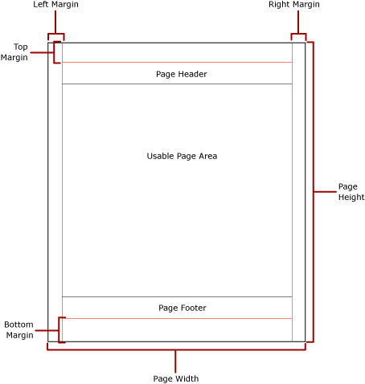
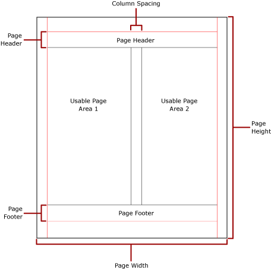

# Pagination in Reporting Services (Report Builder  and SSRS)
  Pagination refers to the number of pages within a report and how report items are arranged on these pages. Pagination in [!INCLUDE[ssRSnoversion](../../../includes/ssrsnoversion-md.md)] varies depending on the rendering extension you use to view and deliver the report. When you run a report on the report server, the report uses the HTML renderer. HTML follows a specific set of pagination rules. If you export the same report to PDF, for example, the PDF renderer is used and a different set of rules are applied; therefore, the report paginates differently. To successfully design an easy-to-read report for your users that is optimized for the renderer that you plan to use to deliver your report, you need to understand the rules used to control pagination in [!INCLUDE[ssRSnoversion](../../../includes/ssrsnoversion-md.md)].  
  
 This topic discusses the impact of the physical page size and the report layout on how hard page break renderers render the report. You can set properties to modify the physical page size and margins, and divide the report into columns, by using the **Report Properties** pane, the **Properties** pane, or the **Page Setup** dialog box. You access the **Report Properties** pane by clicking the blue area outside the report body. You access the **Page Setup** dialog box by clicking **Run** on the Home tab, and then clicking **Page Setup** on the Run tab.  
  
> [!NOTE]  
>  If you have designed a report to be one page wide, but it renders across multiple pages, check that the width of the report body, including margins, is not larger than the physical page size width. To prevent empty pages from being added to your report, you can reduce the container size by dragging the container corner to the left.  
  
> [!NOTE]  
>  [!INCLUDE[ssRBRDDup](../../includes/ssrbrddup-md.md)]  
  
## The Report Body  
 The report body is a rectangular container displayed as white space on the design surface. It can grow or shrink to accommodate the report items contained within it. The report body does not reflect the physical page size and, in fact, the report body can grow beyond the boundaries of the physical page size to span multiple report pages. Some renderers, such as [!INCLUDE[ofprexcel](../../includes/ofprexcel-md.md)], Word, HTML and MHTML, render reports that grow or shrink depending on the contents of the page. Reports rendered in these formats are optimized for screen-based viewing, such as in a Web browser. These renderers add vertical page breaks when required.  
  
 You can format the report body so that there is a border color, border style and border width. You can also add a background color and background image.  
  
## The Physical Page  
 The physical page size is the paper size. The paper size that you specify for the report controls how the report is rendered. Reports rendered in hard page break formats insert page breaks horizontally and vertically based on the physical page size to provide an optimized reading experience when printed or viewed in a hard page break file format. Reports rendered in soft page break formats insert page breaks horizontally based on the physical size to provide an optimized reading experience when viewed in a Web browser.  
  
 By default, the page size is 8.5 x 11 inches but you can change this size by using the **Report Properties** pane, **Page Setup** dialog box or by changing the PageHeight and PageWidth properties in the **Properties** pane. The page size does not grow or shrink to accommodate the contents of the report body. If you want the report to appear on a single page, all the content within the report body must fit on the physical page. If it does not fit and you use the hard page break format, then the report will require additional pages. If the report body grows past the right edge of the physical page, then a page break is inserted horizontally. If the report body grows past the bottom edge of the physical page, then a page break is inserted vertically.  
  
 If you want to override the physical page size that is defined in the report, you can specify the physical page size using the Device Information settings for the specific renderer that you are using to export the report. For more information, see [Reporting Services Device Information Settings](http://go.microsoft.com/fwlink/?LinkId=102515).  
  
### Margins  
 Margins are drawn from the edge of the physical page dimensions inward to the specified margin setting. If a report item extends into the margin area, it is clipped so that the overlapping area is not rendered. If you specify margin sizes that cause the horizontal or vertical width of the page to equal zero, the margin settings default to zero. Margins are specified using the **Report Properties** pane, **Page Setup** dialog box or by changing the TopMargin, BottomMargin, LeftMargin and RightMargin properties in the **Properties** pane. If you want to override the margin size that is defined in the report, you can specify the margin size using the Device Information settings for the specific renderer that you are using to export the report.  
  
 The area of the physical page that remains after space is allocated for margins, column spacing, and the page header and footer, is called the *usable page area*. Margins are only applied when you render and print reports in hard page break renderer formats. The following image indicates the margin and usable page area of a physical page.  
  
   
  
### Newsletter-Style Columns  
 Your report can be divided into columns, such as columns in a newspaper, that are treated as logical pages rendered on the same physical page. They are arranged from left to right, top to bottom, and are separated by white space between each column. If the report is divided into more than one column, each physical page is divided vertically into columns, each of which is considered a logical page. For example, suppose you have two columns on a physical page. The content of your report fills the first column and then the second column. If the report does not fit entirely within the first two columns, the report fills the first column and then the second column on the next page. Columns continue to be filled, from left to right, top to bottom until all report items are rendered. If you specify column sizes that cause the horizontal width or vertical width to equal zero, the column spacing defaults to zero.  
  
 Columns are specified using the **Report Properties** pane, **Page Setup** dialog box or by changing the TopMargin, BottomMargin, LeftMargin and RightMargin properties in the **Properties** pane. If you want to use a margin size that is not defined, you can specify the margin size using the Device Information settings for the specific renderer that you are using to export the report. Columns are only applied when you render and print reports in PDF or Image formats. The following image indicates the usable page area of a page containing columns.  
  
   
  
## Page Breaks and Page Names  
 A report might be more readable and its data easier to audit and export when the report has page names. Reporting Services provides properties for reports and tablix data regions (table, matrix, and list), groups, and rectangles in the report to control pagination, reset page numbers, and provide new report page names on page breaks. These features can enhance reports regardless of the format in which reports are rendered, but are especially useful when exporting reports to Excel workbooks.  
  
 The InitialPageName property provides the initial page name of the report. If your report does not include page names for page breaks, then the initial page name is used for all the new pages created by page breaks. It is not required to use an initial page name.  
  
 A rendered report can provide a new page name for the new page that a page break causes. To provide the page name, you set the PageName property of a table, matrix, list, group, or rectangle. It is not required that you specify page names on breaks. If you do not, the value of InitialPageName is used instead. If InitialPageName is also blank, the new page has no name.  
  
 Tablix data regions (table, matrix, and list), groups, and rectangles support page breaks.  
  
 The page break includes the following properties:  
  
-   BreakLocation provides the location of the break for the page break enabled report element: at the start, end, or start and end. On groups, BreakLocation can be located between groups.  
  
-   Disabled indicates whether a page break is applied to the report element. If this property evaluates to True, the page break is ignored. This property is used to dynamically disable page breaks based on expressions when the report is run.  
  
-   ResetPageNumberindicates whether the page number should be reset to 1 when a page break occurs. If this property evaluates to True, the page number is reset.  
  
 You can set the BreakLocation property in the **Tablix Properties**, **Rectangle Properties**, or **Group Properties** dialog boxes, but you must set the Disabled, ResetPageNumber, and PageName properties in the Report Builder Properties pane. If the properties in the Properties pane are organized by category, you will find the properties in the **PageBreak** category. For groups, the **PageBreak** category is inside the **Group** category.  
  
 You can use constants and simple or complex expressions to set the value of the Disabled and ResetPageNumber properties. However, you cannot use expression with the BreakLocation property. For more information about writing and using expressions, see [Expressions &#40;Report Builder and SSRS&#41;](expressions-report-builder-and-ssrs.md).  
  
 In your report you can write expressions that reference the current page names or page numbers by using the `Globals` collection. For more information, see [Built-in Globals and Users References &#40;Report Builder and SSRS&#41;](built-in-collections-built-in-globals-and-users-references-report-builder.md).  
  
### Naming Excel Worksheet Tabs  
 These properties are useful when you export reports to Excel workbooks. Use the InitialPage property to specify a default name for the worksheet tab name when you export the report, and use page breaks and the PageName property to provide different names for each worksheet. Each new report page, defined by a page break, is exported to a different worksheet named by the value of the PageName property. If PageName is blank, but the report has an initial page name, then all worksheets in the Excel workbook use the same name, the initial page name.  
  
 For more information about how these properties work when reports are exported to Excel, see [Exporting to Microsoft Excel &#40;Report Builder and SSRS&#41;](../report-builder/exporting-to-microsoft-excel-report-builder-and-ssrs.md).  
  
## See Also  
 [Page Layout and Rendering &#40;Report Builder and SSRS&#41;](page-layout-and-rendering-report-builder-and-ssrs.md)  
  
  
