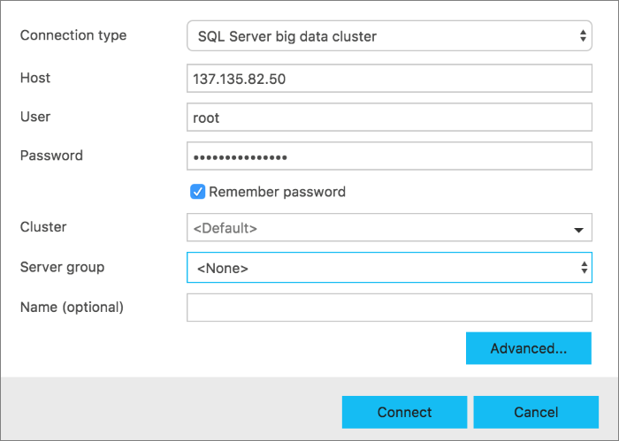
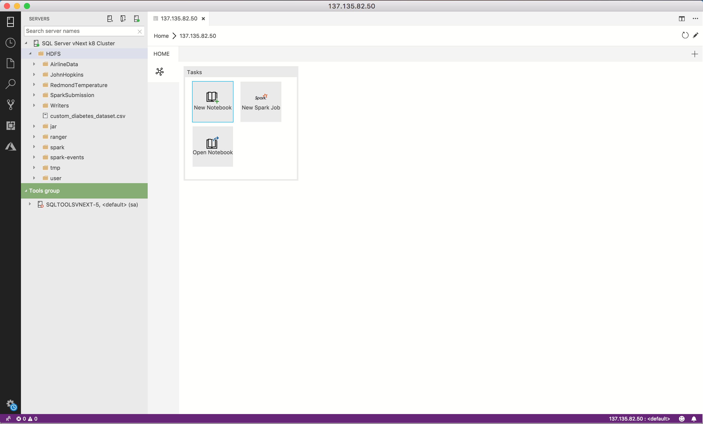
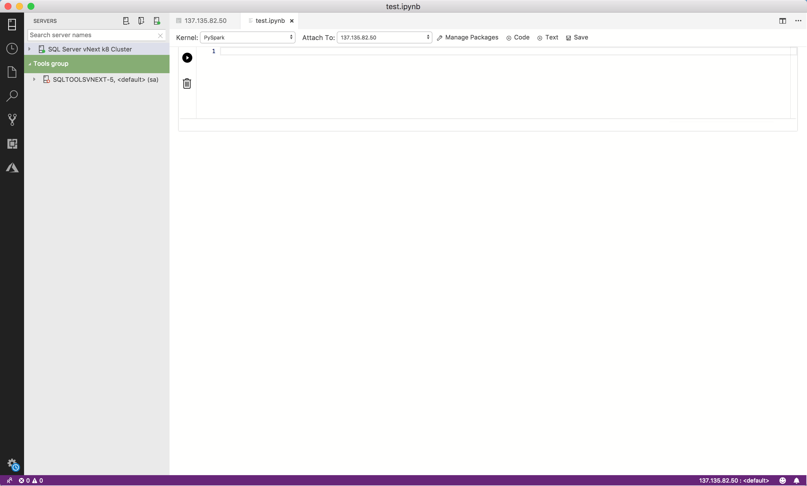

# How to use notebooks in SQL Server 2019 preview

This article shows how to launch notebooks on a SQL Server 2019 big data cluster. It also shows how to start authoring your own notebooks and how to submit jobs against the cluster.

## Prerequisites

To use notebooks, you must install the following prerequisites:

- [A SQL Server 2019 big data cluster](deployment-guidance.md)
- [Azure Data Studio](../azure-data-studio/what-is.md)
- [The SQL Server 2019 extension (preview)](../azure-data-studio/sql-server-2019-extension.md).

[!INCLUDE [Limited public preview note](../includes/big-data-cluster-preview-note.md)]

## Connect to the SQL Server big data cluster end-point

You can connect to different end-points in the cluster. You can connect to the Microsoft SQL Server connection type or to the SQL Server big data cluster end-point.

In Azure Data Studio (preview), type **F1** > **New Connection**, and connect to your SQL Server big data cluster end-point.



## Browse HDFS
Once you connect, you will be able to browse your HDFS folder. WebHDFS is started when the deployment is completed, and you will be able to **Refresh**, add **New Directory**, **Upload** files, and **Delete**.


These simple operations let you bring your own data into HDFS.

## Launch new Notebooks

There are multiple ways to launch a new notebook.

1. From the Manage Dashboard. On making a new connection, you will see a Dashboard. Click on New Notebook task from the Dashboard.

  

1. Right click on the HDFS/Spark connection and you have New Notebook in the context menu


Provide a name of your Notebook (Example: *Test.ipynb*) and click **Save**.



## Supported kernels and attach to context

In our Notebook Installation, we support the PySpark and Spark, Spark Magic kernels that allow users to write Python and Scala code using Spark. We also allow users to choose Python for their local development purposes.


When you select one of these kernels, we will install that kernel in the virtual environment and you can start writing code in the supported language.

| Kernel | Description
|---- |----
|PySpark Kernel| For writing Python code using Spark, compute from the cluster.
|Spark Kernel|For writing Scala code using Spark, compute from the cluster.
|Python Kernel|For writing Python code for local development.

The Attach-to selection provides the context for the Kernel to attach. When you are connected to the SQL Server big data cluster end-point, the default Attach-to selection will be that end-point of the cluster.


> [!NOTE]
> By default, the Spark application is configured with 1 driver and 3 executors that will take approximately 8.5 GB of memory. The recommended configuration to run multiple spark sessions is for each server in the cluster to have at least 32 GB of memory (for example, in an AKS environment use **Standard_D8_v3** VM sizes, which have 32GB of memory).

## Hello world in the different contexts

### Pyspark kernel

Choose the PySpark Kernel and in the cell type in the following code:


Click Run and you should see the Spark Application being started and you will see the following output:


The output should look something similar to the following image.


### Spark kernel
Add a new code cell by clicking the +Code command in the toolbar.


Choose the Spark Kernel in the drop-down for the kernels and in the cell type/paste in 


Click **Run**  you should see the Spark Application being started and this will create the Spark session  **spark** and will define the **HelloWorld** object.

The Notebook should look similar to the following image.


Once you define the object then in the next Notebook cell type in the following code:


Click **Run** in the Notebook menu and you should see the "Hello, world!" in the output.


### Local python kernel
Choose the local Python Kernel and in the cell type in **


You should see the following output:


### Markdown Text
Add a new text cell by clicking the +Text command in the toolbar.


Click on the preview icon to add your markdown


Click on the preview icon again to toggle to see just the markdown


## Manage Packages
One of the things we optimized for local Python development was to include the ability to install packages which customers would need for their scenarios. By default, we include the common packages like pandas, numpy etc., but if you are expecting a package that is not included then write the following code in the Notebook cell

```python
import <package-name>
```

When you run this command, you will get a `Module not found` error. If your package exists, then you will not get the error.

If you find a `Module not Found` error, then click on the **Manage Packages** to launch the terminal with the path for your Virtualenv identified. You can now install packages locally. Use the following command to install the packages:

```
./pip install <package-name>
```

After the package is installed, you should be able to go in the Notebook cell and type in the following command:

```python
import <package-name>
```

Now when you run the cell, you should no longer get the `Module not found` error.

If you want to uninstall a package, use the following command from your terminal:

```
./pip uninstall <package-name>
```

## Next steps

To learn how to work with an existing notebook, see [How to manage notebooks in Azure Data Studio](notebooks-how-to-manage.md).