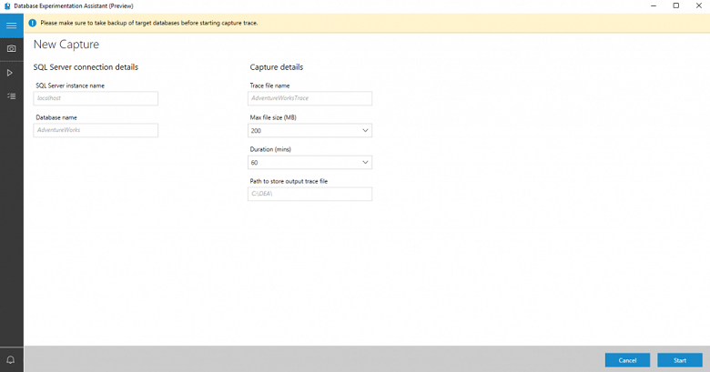
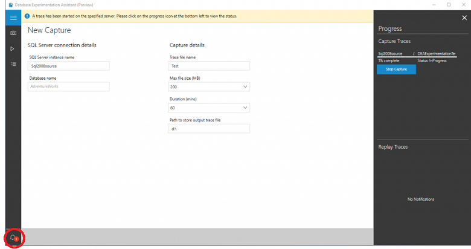

# Capture a trace with Database Experimentation Assistant

Capture Traces lets you produce a trace file (.trc) that includes a log of captured server events. These are events that occurred on a specified server within a specified time period. Capture trace must be run once per server.

- Before starting your trace capture, make sure you back up all your target databases.
- Query caching in SQL can affect evaluation results. We recommend restarting the SQL Server service (MSSQLSERVER) in the services application to improve consistency in evaluation results.

## Open Capture Traces
Open the tool and select the menu icon on the left side of the screen. This opens the left side-bar menu. Choose **Capture Traces** next to the camera icon to open Capture Traces.

## Enter inputs for capturing traces  
Enter the following information in the input fields before starting the capture trace operation.

- **Server name:** Provide a SQL server name where the server trace you want captured is running.
- **Database name:** Provide a Database name to start the trace on it. If you don't specify a database, trace will be captured on all the databases on the server.
- **Name for capture:** Name the trace file (.trc) for your capture.
- **Max file size:** Specify the rollover size for files; a new file will be created, as needed, at the specified file size. Recommended rollover size is 200 MB.
- **Duration:** Select the length of time (in minutes) you want the capture trace to run.
- **Path to store output trace file:** Specify the destination path for the trace file. 

> [!NOTE]
> File path to trace file must be on the machine the SQL instance is on. If SQL Service is not set for a specific account, it may need write permissions to the specified folder in order for the trace file to be written.
>
>

## Begin capturing traces
After you enter all input information, select **Start** to begin capturing traces. If the inputs are valid, the capture trace process begins. Otherwise the fields that have invalid inputs are highlighted with red. 

Make sure the entered values are correct, and again select **Start**.

After the capture trace has finished running, locate your new trace file in the file location you specified. Select the bell icon at the bottom left of the navigation pane to monitor the progress of the capture.

**Trace File (.trc)** – Capture Trace writes out a .trc file to the location specified. This file includes trace results of the activity of a SQL database. TRC files are designed to provide more information about errors that are detected and reported by SQL Server.

## Frequently asked questions about Capture Trace
Following are some frequently asked questions about Capture Trace.

### What events are captured while running trace on a production database?

The following table provides the list of events and the corresponding column data that we collect for the traces:
  
|Event Name|Text Data (1)|Binary Data (2)|Database ID (3)|Host Name (8)|Application Name (10)|Login Name (11)|SPID (12)|Start Time (14)|End Time (15)|Database Name (35)|Event Sequence (51)|IsSystem (60)|  
|---|---|---|---|---|---|---|---|---|---|---|---|---|  
|**RPC:Completed (10)**||*|*|*|*|*|*|*|*|*|*|*|  
|**RPC:Starting (11)**||*|*|*|*|*|*|*||*|*|*|  
|**RPC Output Parameter (100)**|*||*|*|*|*|*|*||*|*|*|  
|**SQL:BatchCompleted (12)**|*||*|*|*|*|*|*|*|*|*|*|  
|**SQL:BatchStarting (13)**|*||*|*|*|*|*|*||*|*|*|  
|**Audit Login (14)**|*|*|*|*|*|*|*|*||*|*|*|  
|**Audit Logout (15)**|*||*|*|*|*|*|*|*|*|*|*|  
|**ExistingConnection (17)**|*|*|*|*|*|*|*|*||*|*|*|  
|**CursorOpen (53)**|*||*|*|*|*|*|*||*|*|*|  
|**CursorPrepare (70)**|*||*|*|*|*|*|*||*|*|*|  
|**Prepare SQL (71)**|||*|*|*|*|*|*||*|*|*|  
|**Exec Prepared SQL (72)**|||*|*|*|*|*|*||*|*|*|  
|**CursorExecute (74)**|*||*|*|*|*|*|*||*|*|*|  
|**CursorUnprepare (77)**|*||*|*|*|*|*|*||*|*|*|  
|**CursorClose (78)**|*||*|*|*|*|*|*||*|*|*|  

### Will there be any performance impact on my production server while capturing traces?
    
Yes, there will be minimal performance impact during trace collection. Based on our tests we have found about 3% memory pressure.
    
### What kind of permissions are required for capturing traces from production workload?
    
- The Windows user running the trace operation in the DEA Application must have sysadmin privileges in the target SQL Server.
- The service account under which the SQL Server is running must have write access to the specified trace file path.

### Can I capture trace for the entire server vs one single database?
    
Yes, DEA lets you capture traces for all databases in the server or for one single database.
    
### I have a linked server configured in my production environment. Do those queries show up in the traces?
    
If you're running capture for the entire server, the trace captures all queries, including the linked server queries. To run capture for the entire server, leave the Database name field in the capture screen empty.
    
### What is the minimum recommended time for production workload traces?
    
We recommend that you choose a time that best represents the entirety of your workload. That way, the analysis runs on all the queries in your workload.
    
### How important is to take database backup right before the start of the trace capture?
    
Before starting your trace capture, make sure you back up all your target databases. The captured trace in Target 1 and Target 2 is replayed, and if the database state is not the same, the results of the experimentation are skewed.

### Can we collect XEvents instead of traces and replay the same?
    
Yes. XEvents support is available in DEA. Download the latest version and give it a try.

## Troubleshooting Capture Trace
If you receive an error while running Capture Trace, first review the following prerequsites to see if it resolves the error:

- Confirm the SQL Server name is valid. To confirm, try connecting to the server using SSMS.
- Confirm your firewall configuration isn't blocking connections to SQL Server.
- Confirm user has the permissions listed in the blog posting [Replay FAQ](https://blogs.msdn.microsoft.com/datamigration/2017/03/24/dea-2-0-replay-faq/).
- Confirm that trace name doesn't follow the standard rollover convention (that is, 'Capture\_1'). You can instead try trace names like 'Capture\_1A' or 'Capture1'.

Following are some possible errors you might see and solutions for resolving them:

|Possible Errors|Solution|  
|---|---|  
|Unable to start the trace on the target SQL Server, check if you have required permissions and SQL Server account has write access to the specified trace file path Sql Error Code (53)|The user running the DEA Tool should have access to SQL Server and have 'sysadmin' role assigned to the user|  
|Unable to start the trace on the target SQL Server, check if you have required permissions and SQL Server account has write access to the specified trace file path Sql Error Code (19062)|The trace path specified might not exist or the folder doesn't have write permissions for the account under which SQL Server services are running (for example, NETWORK SERVICE). The path should exist with right permissions in order for the trace to start.|  
|A DEA trace is currently running on the target server.|An active trace is already running on the target server, DEA will not allow to multiple traces when a server-wide trace is already running.|  
|Can't open database requested for capturing trace. This error may be due to incorrect database name|The database specified doesn’t exist or it’s not accessible to the current user. Correct the database name|  

If you see any other errors with Sql Error Code, see [System Error Messages](https://docs.microsoft.com/previous-versions/sql/sql-server-2008-r2/cc645603(v=sql.105)) for detailed description and resolution.
    
## Next steps

- [Configure replay](database-experimentation-assistant-configure-replay.md) shows you how to configure the Distributed Replay tools in SQL before replaying a captured trace.

- For a 19-minute introduction and demonstration of DEA, watch the following video:

  > [!VIDEO https://channel9.msdn.com/Shows/Data-Exposed/Introducing-the-Database-Experimentation-Assistant/player]
